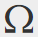

# Verwenden des Rich-Text-Editors {#using-the-rich-text-editor}

Der Rich-Text-Editor (RTE) wird überall in Marketo angezeigt und ist verfügbar, wenn Sie Inhalte hinzufügen oder bearbeiten möchten. Sie sehen eine Version davon auf Landingpages, Programmen, E-Mails, Formularen und Snippets. Klicken Sie einfach auf **Entwurf bearbeiten**, und es wird auftauchen, um Ihnen zu dienen.

## Editor-Einstellungen {#editor-settings}

Die Einstellung des Stammblock-Elements definiert, welche Tags Ihren Inhalt umschließen. Standardmäßig nutzt das Element E-Mail-Stammbaustein `
` Tags. Sie können dies ändern, indem Sie die folgenden Schritte ausführen.

>[!TIP]
>
>Sie haben zwar die Möglichkeit, Ihr Stammblock-Element auszuwählen, doch empfehlen wir für ein bestes Benutzererlebnis immer die Verwendung von Standardeinstellungen.

1. Klicken **Admin**.

   

1. Klicken **Email**.

   

1. Klicken **Bearbeiten der Einstellungen des Texteditors**.

   

1. Im **E-Mail-/Snippet-Editor** Dropdown-Liste auswählen `
` oder &quot;Keine&quot;und klicken Sie auf **Speichern**. `
` wird in diesem Beispiel verwendet.

   

   Wenn Sie `

` in einer E-Mail-Vorlage sehen Sie das folgende HTML-Quellverhalten, wenn Sie den Bereich öffnen und im Editor &quot;Text geht hierher&quot;eingeben:

<table> 
 <tbody> 
  <tr> 
   <th>&lt;p&gt;</th> 
   <th>&lt;div&gt;</th> 
   <th>Keine</th> 
  </tr> 
  <tr> 
   <td>
&lt;div class="“mktEditable”"&gt; &lt;p&gt;Text wird hier angezeigt&lt;/p&gt; &lt;/div&gt;
</td> 
   <td>
&lt;div class="“mktEditable”"&gt; &lt;div&gt;Text wird hier angezeigt&lt;/div&gt; &lt;/div&gt;
</td> 
   <td>
&lt;div class="“mktEditable”"&gt; Text wird hier angezeigt &lt;/div&gt;
</td> 
  </tr> 
 </tbody> 
</table>

>[!TIP]
>
>Sie können auch das Stammblock-Element des Landingpage-Editors ändern, indem Sie dieselben Schritte ausführen, aber auf **Landingpage-Editor** Dropdown-Liste in Schritt 4 anstelle des E-Mail-/Snippet-Editors.

>[!NOTE]
>
>Das Stamm-Block-Element ist immer `
` für Rich-Text-Programm-Token.

## Funktionen {#features}

Hier finden Sie die Funktionen, die Sie in einem RTE finden.

| Symbol | Name | Funktion |
|---|---|---|
|  | Schriftfamilie | Wählen Sie Ihren Stil - wir haben jede Menge! |
|  | Schriftgröße | Wie groß willst du es? 25 Auswahlmöglichkeiten, von 8 px bis 90 px. |
|  | Stile | Wählen Sie Absatz oder sechs Überschriftenstile (für Landingpages). |
|  | Zeilenabstand | Pick deinen Abstand zwischen den Zeilen. |
|  | Textfarbe | Schwarz, Rot oder was immer Sie wollen. |
|  | Hintergrundfarbe | Hervorhebung der Hervorhebung. |
|  | Fett | **Dunkler und dicker**. |
|  | Kursiv | *gelinkt, für Hervorhebung oder Notierung* s. |
|  | Unterstreichen | Legt eine Zeile unter den Text. |
|  | Ausrichtung | Verwenden Sie dieses Dropdown-Menü, um Ihren Text und Ihre Bilder darzustellen. Zentrieren Sie sie, wählen Sie eine linke oder rechte Ausrichtung oder teilen Sie sie mit vollständiger Ausrichtung an den Rand. |  |  | Liste | Wählen Sie Aufzählungszeichen oder Zahlen aus der Dropdown-Liste aus. Aufzählungszeichen eignen sich gut für Listen und Zahlen mit Schritten. |
|  | Einrücken | Wählen Sie mehr oder weniger Einzug. Verwenden Sie für Absätze oder Text, den Sie hervorheben möchten. |
|  | Link einfügen/bearbeiten | einen Link zu einer Website oder anderen Inhalten einfügen; einfach Änderungen daran vorzunehmen. |
|  | Bild einfügen/bearbeiten | Ein Bild sagt mehr als tausend Worte. Legen Sie eine ab. Klicken Sie auf das Kamerasymbol, um Ihr Design Studio zu durchsuchen. Sie können Bilder nebeneinander einfügen. |
|  | Token einfügen | Ein leistungsstarkes Tool, ideal für die Personalisierung von E-Mails und das Tracking von Daten. Geben Sie unbedingt einen Standardwert ein. |
|  | Rückgängig | Entschuldigung! Lass uns einen Schritt zurückgehen und es noch einmal versuchen. |
|  | Wiederholen | Wenn es wirklich in Ordnung ist, so wie es ist, kehren Sie zum Original zurück. |
|  | Tabelle | Erstellen Sie Ihre eigene, wie diese hier. Ein Dropdown-Menü ermöglicht die Konfiguration. |
|  | Anker einfügen | Drop anchor! |
|  | Horizontale Linie | Viele Verwendungen - Ideal für die Teilung von Abschnitten. |
|  | HTML bearbeiten | Öffnet den HTML Source Editor, damit Sie Ihren Code anpassen können. |
|  | Tiefgestellt | Kleinhängende Buchstaben (wie in O)`2`). |
|  | Hochgestellt | Du hast die Macht! (2`6`). |
|  | Durchstreichen | `<s>Put a line through text, like this</s>`. |
|  | Sonderzeichen | Willst du über Euro reden? Mathematisch? Sie haben 243 Möglichkeiten. |
|  | Suchen und Ersetzen | Suchen und ändern Sie Dinge viel schneller als die Suche nach jeder Instanz selbst. |
|  | Formatierung löschen | Kehren Sie Dinge auf den Standard zurück. |
|  | Cancel | Drücken Sie den Knopf, um zu sagen: &quot;Macht nichts.&quot; |
|  | Save | Drücken Sie die Taste, um zu sagen: &quot;OK, ich mag es.&quot; |

>[!TIP]
>
>Sie bearbeiten HTML und Text auf separaten Bildschirmen. Klicken Sie auf **Kopieren aus HTML** auf **Text** Registerkarte und dann **Speichern** sodass Ihr Text mit Ihrer HTML übereinstimmt.

>[!NOTE]
>
>Sie sind nicht auf die Schriftarten in der Dropdown-Liste beschränkt. Sie können eine nicht aufgeführte verwenden, indem Sie auf den HTML-Code zugreifen. Alle Webfonts werden in Marketo unterstützt, Webfonts funktionieren jedoch nicht in allen E-Mail-Clients allgemein.

## Landing Pages {#landing-pages}

Die Einstellung des Stammblock-Elements definiert, welche Tags Ihren Inhalt umschließen. Standardmäßig verwendet das Stammbaustein-Element der Landingpage `
` Tags. Sie können dies ändern, indem Sie die folgenden Schritte ausführen.

>[!TIP]
>
>Sie haben zwar die Möglichkeit, Ihr Stammblock-Element auszuwählen, doch empfehlen wir für ein bestes Benutzererlebnis immer die Verwendung von Standardeinstellungen.

1. Klicken **Admin**.

   

1. Klicken **Email**.

   

1. Klicken **Bearbeiten der Einstellungen des Texteditors**.

   

1. Im **Landingpage-Editor** Dropdown-Liste auswählen `
` oder &quot;Keine&quot;und klicken Sie auf **Speichern**. `
` wird in diesem Beispiel verwendet.

   

   Und das ist es!
