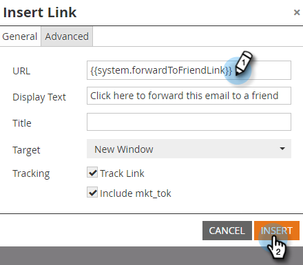

# hinzufügen eines System-Tokens als Link in einer E-Mail {#add-a-system-token-as-a-link-in-an-email}

Mit diesen Systemtokens können Sie die Position von speziellen Links in Ihren E-Mails anpassen.

Die folgenden Token können als Links in einer E-Mail- oder E-Mail-Vorlage verwendet werden:

* `{{system.forwardToFriendLink}}`
* `{{system.unsubscribeLink}}`
* `{{system.viewAsWebpageLink}}`

>[!NOTE]
>
>Diese Token sind nur dann anklickbar, wenn sie sich in einem Ankerlink befinden. **** Außerdem können sie **nicht** in ein My Token eingebettet werden.

So fügen Sie sie einer E-Mail hinzu:

1. Suchen und wählen Sie Ihre E-Mail aus und klicken Sie dann auf **Entwurf bearbeiten**.

   

1. Klicken Sie mit der Dublette in einen bearbeitbaren Bereich.

   

1. Markieren Sie den Text, den Sie in einen Link konvertieren möchten, der das Token enthält, und klicken Sie auf die Schaltfläche **Link einfügen/bearbeiten**.

   

1. Geben Sie das Token in der Link-URL ein und klicken Sie auf **Einfügen**.

   

   >[!TIP]
   >
   >Kopieren/Einfügen des gewünschten Tokens: **`{{system.forwardToFriendLink}}`** oder **`{{system.unsubscribeLink}}`** oder **`{{system.viewAsWebpageLink}}`**

1. Klicken Sie auf **Speichern**.

   

>[!NOTE]
>
>Vergessen Sie nicht, [Ihre E-Mail](/help/marketo/product-docs/email-marketing/general/creating-an-email/approve-an-email.md) zu genehmigen, wenn Sie fertig sind.

Gut gemacht! Jetzt wissen Sie, wie Sie ein System-Token als Link in einer E-Mail hinzufügen können.
