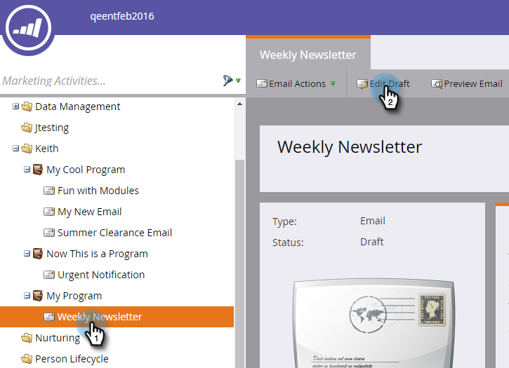
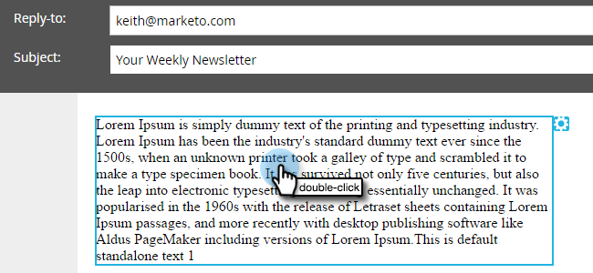
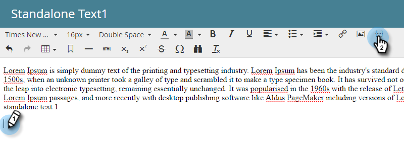

# Hinzufügen eines E-Mail-Skript-Tokens zu einer E-Mail {#add-an-email-script-token-to-your-email}

Nachdem Sie [E-Mail-Skript erstellt](/help/marketo/product-docs/email-marketing/general/using-tokens/create-an-email-script-token.md) sollten Sie es zu einer E-Mail hinzufügen, um es in Aktion zu sehen. Und so geht das.

>[!NOTE]
>
>Die Gesamtgröße aller in eine einzelne E-Mail eingefügten Skript-Token darf 100 KB nicht überschreiten.

1. Navigieren Sie zum Bereich **[!UICONTROL Marketing-Aktivitäten]**.

   

1. Suchen Sie die E-Mail, der Sie das Token hinzufügen möchten, und wählen Sie sie aus. Klicken Sie dann auf **[!UICONTROL Entwurf bearbeiten]**.

   

   >[!TIP]
   >
   >Sie können das Token auch zu einer E-Mail-Vorlage hinzufügen, wenn Sie es vorziehen.

1. Doppelklicken Sie auf den bearbeitbaren Bereich, dem Sie das Token hinzufügen möchten.

   

1. Platzieren Sie den Cursor an der gewünschten Stelle und klicken Sie auf das Symbol Token einfügen .

   

1. Suchen Sie das zuvor erstellte E-Mail-Skript-Token, wählen Sie es aus und klicken Sie auf **[!UICONTROL Einfügen]**.

   

1. Klicken Sie auf **Speichern**.

   

>[!NOTE]
>
>Vergiss nicht, die E[Mail zu genehmigen](/help/marketo/product-docs/email-marketing/general/creating-an-email/approve-an-email.md).

Wenn diese E-Mail gesendet wird, wird das Skript hinter dem Token ausgeführt und mit Inhalten gefüllt.
