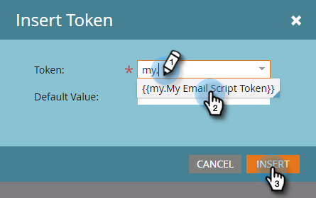

# E-Mail-Skript-Token hinzufügen {#add-an-email-script-token-to-your-email}

Nachdem Sie [Ihr E-Mail-Skript erstellt haben](/help/marketo/product-docs/email-marketing/general/using-tokens/create-an-email-script-token.md), möchten Sie es zu einer E-Mail hinzufügen, damit es in Aktion angezeigt wird. So geht es.

>[!NOTE]
>
>Die Gesamtgröße aller Skript-Token, die in eine einzelne E-Mail eingefügt werden, darf 100 KB nicht überschreiten.

1. Wechseln Sie zum Bereich **Marketingaktivitäten** .

   

1. Suchen und wählen Sie die E-Mail aus, der Sie das Token hinzufügen möchten, und klicken Sie auf **Entwurf bearbeiten**.

   

   >[!TIP]
   >
   >Sie können das Token bei Bedarf auch zu einer E-Mail-Vorlage hinzufügen.

1. Doppelklicken Sie auf den bearbeitbaren Bereich, dem Sie das Token hinzufügen möchten.

   

1. Platzieren Sie den Cursor an die Stelle, an der das Token platziert werden soll, und klicken Sie auf das Symbol Token einfügen .

   

1. Suchen und wählen Sie das zuvor erstellte E-Mail-Skript-Token aus und klicken Sie auf **Einfügen**.

   

   >[!TIP]
   >
   >Fügen Sie bei Bedarf einen Standardwert hinzu.

1. Klicken Sie auf **Speichern**.

   

>[!NOTE]
>
>Vergessen Sie nicht, [die E-Mail zu genehmigen](/help/marketo/product-docs/email-marketing/general/creating-an-email/approve-an-email.md).

Das ist es! Wenn diese E-Mail gesendet wird, wird das Skript hinter dem Token ausgeführt und der Inhalt gefüllt.
