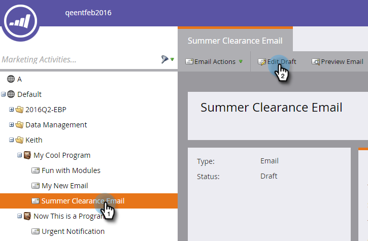

# Hinzufügen von Token zu einem E-Mail-Link {#add-tokens-to-an-email-link}

Um zusätzliche und personenspezifische Parameter in Ihre Links einzufügen, können Sie Token verwenden. Und so geht das.

1. Wählen Sie Ihre E-Mail aus und klicken Sie auf **[!UICONTROL Registerkarte]** Entwurf bearbeiten“.

   

1. Doppelklicken Sie auf einen bearbeitbaren Bereich.

   

1. Suchen Sie den Text für den Link oder schreiben Sie ihn. Markieren Sie sie und klicken Sie auf das Symbol **[!UICONTROL Link einfügen/bearbeiten]** .

   

1. Geben Sie die gewünschten Token in „URL **[!UICONTROL ein]** klicken Sie auf **[!UICONTROL Einfügen]**.

   

1. Klicken Sie auf **[!UICONTROL Speichern]**.

   

   Und das war&#39;s!

>[!MORELIKETHIS]
>
>[Verwenden von URLs in meinen Token](/help/marketo/product-docs/email-marketing/general/using-tokens/using-urls-in-my-tokens.md)
