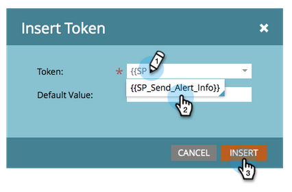

# Verwenden des Tokens „Warnhinweisinfo senden“ {#use-the-send-alert-info-token-sp-send-alert-info}

Das `{{SP_Send_Alert_Info}}`-Token ist ein spezielles Token, das bei der Erstellung von E-Mails zu Warnhinweisen für Ihr Verkaufsteam verwendet werden kann.

>[!TIP]
>
>Dieses Token funktioniert nur wie vorgesehen, wenn die E-Mail, die es enthält, mit dem [Warnhinweis senden](/help/marketo/product-docs/core-marketo-concepts/smart-campaigns/flow-actions/send-alert.md) Flussschritt gesendet wird. Bei Verwendung im Schritt E-Mail senden funktioniert dies nicht.

Beispiel-Warnhinweis:

>[!NOTE]
>
>Kopf hoch! URLs in Warnhinweisen haben ein Ablaufdatum. Stellen Sie daher sicher, dass sie eine Kadenz aufweisen, die diese Nachrichtentypen unterstützt. Ablaufdaten werden [von einem Administrator konfiguriert](/help/marketo/product-docs/administration/settings/edit-link-expiration-in-reports-and-alerts.md).

Die folgenden Informationen sind Teil der `{{SP_Send_Alert_Info}}`:

* Vor- und Nachname als Link zur Personendetails in Marketo
* Ein Link zur Person in Ihrem CRM
* Der Kampagnenname in Marketo, der den Warnhinweis gesendet hat
* Der Zeitpunkt, zu dem die Warnung gesendet wurde

>[!NOTE]
>
>Der Link zum CRM wird nur angezeigt, wenn sich die Person im CRM-System befindet (derzeit nicht mit Dynamics CRM verfügbar). Der Link ist sowohl für Marketo- als auch für Nicht-Marketo-Benutzende verfügbar.

## Hinzufügen des Tokens SP_Send_Alert_Info zu einer E-Mail {#add-the-sp-send-alert-info-token-to-an-email}

1. Wählen Sie die E-Mail aus und klicken Sie **[!UICONTROL Entwurf bearbeiten]**.

   

1. Doppelklicken Sie auf den bearbeitbaren Bereich, dem Sie das Token hinzufügen möchten.

   

1. Platzieren Sie den Cursor an der gewünschten Stelle und klicken Sie auf die Schaltfläche **[!UICONTROL Token einfügen]**.

   

1. Suchen Sie das **[!UICONTROL {{SP_Send_Alert_Info}}]**-Token, wählen Sie es aus und klicken Sie auf **[!UICONTROL Einfügen]**.

   

1. Klicken Sie auf **[!UICONTROL Speichern]**.

   

>[!NOTE]
>
>Vergessen Sie nicht, Ihre E-Mail zu genehmigen.

Gut gemacht! Dieses Token ist sehr nützlich und Sie sollten es in allen Warnhinweisen verwenden, die Sie für Ihr Verkaufs-Team erstellen.
