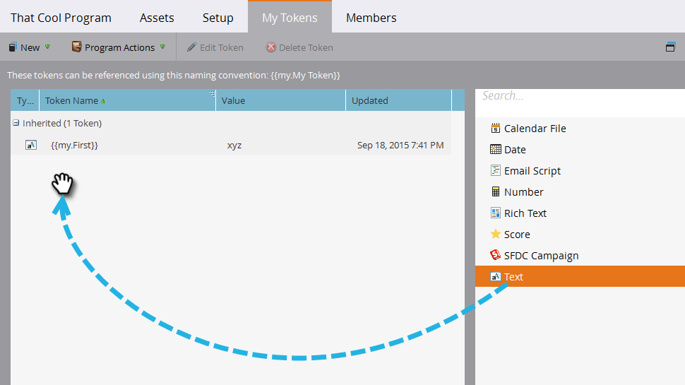

# Verwenden von URLs in meinen Token {#using-urls-in-my-tokens}

Gehen Sie wie folgt vor, um mit meinen Token URLs in Ihre E-Mails einzufügen.

1. Wählen Sie Ihr Programm aus und klicken Sie auf **Meine Token**.

   

1. Wählen Sie **Text** Mein Token aus und ziehen Sie es per Drag-and-Drop auf die Arbeitsfläche.

   

1. Geben Sie dem Token einen eindeutigen Namen, eine URL (ohne https://) und klicken Sie auf **Speichern**.

   

   >[!CAUTION]
   >
   >**Verwenden von http/https…**
   >
   >* Um sicherzustellen, dass Klicks in Ihrer E-Mail verfolgt werden **geben Sie** nicht _https://inside_ den Wert des Tokens ein. Verwenden Sie sie außerhalb des Tokens, wie in Schritt 7 gezeigt.
   >
   >* Es wird dringend empfohlen, http/https nicht auszuschließen. Andernfalls wird die [Web-Version](/help/marketo/product-docs/email-marketing/general/functions-in-the-editor/add-a-view-as-web-page-link-to-an-email.md){target="_blank"} Ihrer E-Mail möglicherweise falsch gerendert.

1. Wählen Sie die E-Mail in Ihrem Programm aus.

   

1. Klicken Sie **Entwurf bearbeiten**.

   

1. Doppelklicken Sie zum Bearbeiten in den Textbereich.

   

1. Geben Sie an einer beliebigen Stelle in Ihrer E-Mail `https://` ein (ohne danach ein Leerzeichen zu hinterlassen) und klicken Sie auf das Symbol Token einfügen .

   

   >[!NOTE]
   >
   >Sie haben natürlich auch die Möglichkeit, `http://` einzugeben, wenn Ihre Website kein https verwendet.

1. Suchen Sie Ihr Mein Token, wählen Sie es aus und klicken Sie auf **Einfügen**.

   

1. Markieren Sie https:// und Token und drücken Sie dann Strg/Befehlstaste+X (Strg = Windows/Befehlstaste = Mac), um den Text auszuschneiden.

   

1. Markieren Sie den Text, den der Link anzeigen soll, und klicken Sie auf das Symbol Link einfügen/bearbeiten .

   

1. Drücken Sie Strg/Befehl+V, um den Inhalt in das Feld **URL** einzufügen, und klicken Sie auf **Einfügen**.

   

1. Klicken Sie auf **Speichern**.

   

   Und du bist fertig! Ihre URL wird nach dem Versand gefüllt und dank der Platzierung von https:// vor dem Token wird ein verfolgbarer Link erzeugt.
