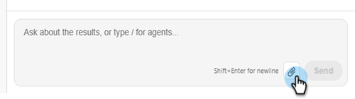
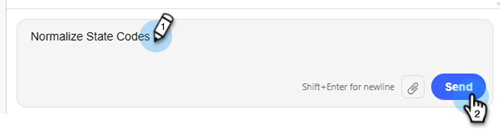

# Leads importieren {#import-leads}

Importieren und deduplizieren Sie Lead-Listen mit Unterstützung für die Feldzuordnung in Ihre Marketo Engage-Datenbank.

>[!NOTE]
>
>Diese Funktion befindet sich in der offenen Beta-Phase und wird in den nächsten Monaten schrittweise eingeführt. Wenn die Kachel „Mit KI erstellen“ auf dem Bildschirm &quot;_Marketo&quot; angezeigt wird, erfahren Sie, wann_ für Ihr Abonnement aktiviert wurde.

## Informationen zur Verwendung {#how-to-use}

1. Klicken Sie in Ihrem Mein Marketo auf die Kachel **Mit KI erstellen**.

   

1. Klicken Sie auf **Leads importieren**-Agent.

   

   Sie gelangen zum Bildschirm der Konversations-KI. Im linken Bereich veröffentlicht der Agent Anleitungen, Antworten und Optionen dazu, welche Datennormalisierungsfunktionen ausgeführt werden sollen.

   

1. Um mit dem Import Ihrer Leads zu beginnen, klicken Sie auf das Anlagensymbol und laden Sie sie über eine CSV-Datei hoch.

   

1. Geben Sie _Importliste_ ein und klicken Sie auf **Senden**.

   

   Die Vorschau Ihrer Liste wird in der mittleren Konsole angezeigt.

   

1. Geben Sie eine gewünschte Geschäftsregel ein und klicken Sie auf **Senden**.

   

   Die Ergebnisse werden in der mittleren Konsole angezeigt.

   

   Geben Sie bei Bedarf zusätzliche Geschäftsregeln ein.

1. Um die zugeordneten Felder anzuzeigen, klicken Sie auf die Registerkarte **Zuordnungen**.

1. Wenn Felder falsch zugeordnet wurden, korrigieren Sie sie hier.

   

1. Wenn Sie bereit sind, Ihre Liste zu importieren, klicken Sie auf die Registerkarte **In Marketo importieren**.

1. Wählen Sie den Zielordner aus und geben Sie einen Namen ein. Markieren Sie jedes Einverständnisfeld und klicken Sie auf **Genehmigen und in Marketo importieren**.

   

Wenn der Import abgeschlossen ist, wird der Überprüfung eine Zusammenfassung der verarbeiteten Leads, der fehlgeschlagenen Zeilen und aller Warnungen bereitgestellt.
