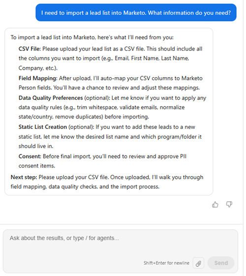

# Leads importieren {#import-leads}

Importieren und deduplizieren Sie Lead-Listen mit Unterstützung für die Feldzuordnung in Ihre Marketo Engage-Datenbank.

>[!AVAILABILITY]
>
>Diese Funktion befindet sich derzeit in der offenen Beta-Phase. Wenden Sie sich an Ihren Account Manager, um Zugriff anzufordern. Sie müssen auch den [Core Gen-AI Bedingungen und den Zusatzbedingungen](https://www.adobe.com/legal/terms/enterprise-licensing/genai-ww.html){target="_blank"} zustimmen.

## Informationen zur Verwendung {#how-to-use}

1. Klicken Sie in „Meine Marketo&quot; auf die Kachel **Marketo AI** .

   

1. Klicken Sie auf **Leads importieren**-Agent.

   

   Sie gelangen zum Bildschirm der Konversations-KI. Im linken Bereich werden Anleitungen, Antworten und verfügbare Datennormalisierungsoptionen angezeigt.

   

1. Um mit dem Import Ihrer Leads zu beginnen, klicken Sie auf das Anlagensymbol und laden Sie sie über eine CSV-Datei hoch.

   

1. Geben Sie „Importliste“ ein und klicken Sie auf **Senden**.

   

   Die Vorschau Ihrer Liste wird in der mittleren Konsole angezeigt.

   

1. Geben Sie eine gewünschte Geschäftsregel ein und klicken Sie auf **Senden**.

   

   Die Ergebnisse werden in der mittleren Konsole angezeigt.

   

   Geben Sie bei Bedarf zusätzliche Geschäftsregeln ein.

1. Um die zugeordneten Felder anzuzeigen, klicken Sie auf die Registerkarte **Zuordnungen**.

1. Wenn Felder falsch zugeordnet wurden, korrigieren Sie sie hier.

   

1. Wenn Sie bereit sind, Ihre Liste zu importieren, klicken Sie auf die Registerkarte **In Marketo importieren**.

1. Wählen Sie den Zielordner aus und geben Sie einen Namen ein. Markieren Sie jedes Einverständnisfeld und klicken Sie auf **Genehmigen und in Marketo importieren**.

   

Wenn der Import abgeschlossen ist, wird eine Überprüfungszusammenfassung mit Leads, verarbeiteten Zeilen, fehlgeschlagenen Zeilen und allen Warnungen angezeigt.

