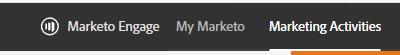

# Überblick über die moderne Benutzeroberfläche von Marketo Engage {#overview}

Willkommen beim modernen Adobe Marketo Engage-Benutzererlebnis, einer aktualisierten Benutzeroberfläche, die in der gesamten Marketo Engage-Plattform für höhere Anwenderfreundlichkeit und ein neues Erscheinungsbild sorgt.

>[!PREREQUISITES]
>
>Wenn Ihr IT-Team den Web-Zugriff mithilfe einer Zulassungsliste einschränkt, bitten Sie es, die folgenden Domains (einschließlich des Sternchens) hinzuzufügen, um alle Marketo-Ressourcen und -Websockets zuzulassen:
>
>* *.marketo.com
>* *.marketodesigner.com
>* *.mktoweb.com

## Neue Funktionen {#whats-new}

Es gibt in der modernen Benutzeroberfläche viele neue Funktionen, die alle dazu konzipiert sind, Ihr Marketing-Erlebnis spürbar zu verbessern.

**Symbole**

Die neue Benutzeroberfläche verfügt über eine verbesserte und erweiterte Symboldarstellung.

**Globale Navigation**

Auf Nimmerwiedersehen, Superball. Es gibt jetzt Schnellzugriff auf alle wichtigen Marketo Engage-Bereiche.

**Instanz-URL**

Außerdem haben Sie Schnellzugriff auf Ihre Munchkin-ID, die sich jetzt in der URL Ihrer Instanz widerspiegelt (besonders hilfreich für Benutzende mit mehreren Abonnements).

## Neue Baumstrukturoptionen {#new-tree-options}

Es gibt eine Menge neuer Baumstrukturfunktionen.

>[!NOTE]
>
>Wenn Sie eine Suche in der Baumstruktur durchführen, werden nur die ersten 250 Ergebnisse angezeigt. Falls Sie nach einer Suche Ihr Asset nicht finden können, verwenden Sie die Funktion [Globale Suche](/help/marketo/product-docs/marketo-engage-modern-ux/using-the-global-search.md).

**Marketo Classic im Vergleich zum neuen Marketo**

<table>
 <tbody>
  <tr>
   <th>Funktion</th>
   <th>Classic</th>
   <th>Nächste Generation</th>
  </tr>
  <tr>
   <td>Gleichzeitiges Anwenden mehrerer Filter</td>
   <td></td>
   <td><strong>X</strong></td>
  </tr>
  <tr>
   <td>Knoten mit kombinierter Entwurfs- und Genehmigungsstruktur</td>
   <td></td>
   <td><strong>X</strong></td>
  </tr>
  <tr>
   <td>Erstellen lokaler Assets in Programmordnern</td>
   <td></td>
   <td><strong>X</strong></td>
  </tr>
  <tr>
   <td>Doppelklicken, um Baumknoten ein- bzw. auszublenden</td>
   <td><strong>X</strong></td>
   <td><strong>X</strong></td>
  </tr>
  <tr>
   <td>Drag-and-Drop von Baumstruktur zum Interaktionsstrom</td>
   <td><strong>X</strong></td>
   <td></td>
  </tr>
  <tr>
   <td>Drag-and-Drop innerhalb der Baumstruktur</td>
   <td><strong>X</strong></td>
   <td><strong>X</strong></td>
  </tr>
  <tr>
   <td>Filtern nach Asset-Typ und -Status</td>
   <td><i>teilweise</i></td>
   <td><strong>X</strong></td>
  </tr>
  <tr>
   <td>Hervorheben von Hintergrund, um Hierarchie im Fokusstatus anzuzeigen</td>
   <td></td>
   <td><strong>X</strong></td>
  </tr>
  <tr>
   <td>Hervorheben von Schlüsselwörtern während der Suche</td>
   <td></td>
   <td><strong>X</strong></td>
  </tr>
  <tr>
   <td>Horizontales Scrollen</td>
   <td><strong>X</strong></td>
   <td><strong>X</strong></td>
  </tr>
  <tr>
   <td>Status beim Bewegen des Mauszeigers über Baumknoten</td>
   <td><strong>X</strong></td>
   <td><strong>X</strong></td>
  </tr>
  <tr>
   <td>Schnelles Reduzieren der gesamten Baumstruktur</td>
   <td></td>
   <td><strong>X</strong></td>
  </tr>
  <tr>
   <td>Schnelles Reduzieren auf Stammknoten</td>
   <td></td>
   <td><strong>X</strong></td>
  </tr>
  <tr>
   <td>Echtzeit-Update</td>
   <td></td>
   <td><strong>X</strong></td>
  </tr>
  <tr>
   <td>Größe der Baumstruktur veränderbar</td>
   <td><strong>X</strong></td>
   <td><strong>X</strong></td>
  </tr>
  <tr>
   <td>Suchen in archivierten Ordnern</td>
   <td></td>
   <td><strong>X</strong></td>
  </tr>
  <tr>
   <td>Suchzeichenfolge wird bei Eingabe der globalen Suche über die Baumsuche gespeichert</td>
   <td></td>
   <td><strong>X</strong></td>
  </tr>
  <tr>
   <td>Anzeigen aller Arbeitsbereiche in einer Baumstruktur</td>
   <td><strong>X</strong></td>
   <td><strong>X</strong></td>
  </tr>
  <tr>
   <td>Status-Badge und Kurzinfos</td>
   <td></td>
   <td><strong>X</strong></td>
  </tr>
  <tr>
   <td>„Wort beginnt mit“-Suchlogik</td>
   <td></td>
   <td><strong>X</strong></td>
  </tr>
 </tbody>
</table>

## Globale Navigation {#global-nav}

Werfen Sie einen Blick auf die neue globale Navigation.

<table>
 <tbody>
  <tr>
   <td>1</td>
   <td>Kein Superball-Dropdown mehr</td>
  </tr>
  <tr>
   <td>2</td>
   <td>Alle vorherigen Superball-Elemente aufgelistet</td>
  </tr>
  <tr>
  <tr>
   <td>3</td>
   <td>Wenn Sie mehrere Abonnements haben, klicken Sie auf den Namen Ihres Abonnements, um ganz einfach zu einem anderen zu wechseln.</td>
  </tr>
  <tr>
   <td>4</td>
   <td>Globale Suche: Sie können jetzt von hier aus Ihre gesamte Instanz durchsuchen.</td>
  </tr>
 </tbody>
</table>

>[!NOTE]
>
>Alles, was sich bisher im Superball-Dropdown befand, ist weiterhin als Kachel unter „Mein Marketo“ verfügbar.

>[!TIP]
>
>Die Verwendung der Suche in der Baumstruktur liefert nur Ergebnisse aus dem Bereich, in dem Sie sich befinden (z. B. Marketing-Aktivitäten). Wenn Sie die gesamte Instanz durchsuchen möchten, nutzen Sie die globale Suche.

Freuen Sie sich auf das neue Marketo Engage-Erlebnis!
