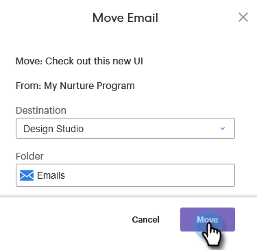

# Verschieben von Assets {#moving-assets}

Drag &amp; Drop ist derzeit nicht verfügbar, aber Sie können Assets trotzdem einfach verschieben.

>[!NOTE]
>
>Ordner in Design Studio können innerhalb desselben Arbeitsbereichs verschoben werden, derzeit jedoch nicht zwischen Arbeitsbereichen.

1. Suchen Sie in der Struktur nach dem Asset, das Sie verschieben möchten. Klicken Sie mit der rechten Maustaste darauf und wählen Sie **Verschieben**.

   

1. Wählen Sie den Zielabschnitt aus.

   

>[!NOTE]
>
>Nachfolgende Optionen in diesem Modal können sich je nach ausgewähltem **Ziel** ändern.

1. Wählen Sie den Zielordner aus.

   

1. Klicken Sie auf **Verschieben**.

   

So einfach!
