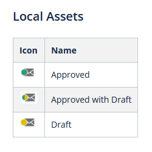

# Übersicht {#overview}

Willkommen bei der nächsten Generation von Marketo Engage, einer neuen Benutzeroberfläche, die eine verbesserte Benutzerfreundlichkeit und ein neues Erscheinungsbild auf der gesamten Marketo-Plattform bietet.

>[!PREREQUISITES]
>
>Wenn Ihr IT-Team den Webzugriff mithilfe einer Zulassungsliste einschränkt, bitten Sie die IT-Mitarbeiter, die folgenden Domänen (einschließlich des Sternchen) hinzuzufügen, damit alle Marketing-Ressourcen und Websockets zugelassen werden:
>
>* *.marketo.com
>* *.marketodesigner.com
>* *.mktoweb.com

## Nehmen Sie die Tour {#take-the-tour}

Bei der ersten Anmeldung erscheint ein Popup, das Ihnen den Überblick über das neue Erlebnis geben kann. Nach dem Hochladen ist **nicht** später verfügbar, wenn Sie es überspringen.

Die Tour führt Sie durch alles, was Sie wissen müssen!

## Neue Funktionen {#whats-new}

Es gibt eine Menge neuer Funktionen in diesem Erlebnis der nächsten Generation, die alle darauf ausgelegt sind, Ihre Marketingerfahrung deutlich zu verbessern.

**Symbole**

Die neue Benutzeroberfläche bietet verbesserte und erweiterte Ikonografie. Weitere Informationen finden Sie hier: [Neues Symbol Glossar](/help/marketo/product-docs/marketo-engage-next-generation-experience/new-icon-glossary.md).

**Baum**

Auch der Baum wurde aktualisiert.

**Globale Navigation**

Auf Wiedersehen Superball. Sie haben jetzt schnellen Zugriff auf alle wichtigen Marketo-Abschnitte.

**Instanz-URL**

Sie haben auch schnellen Zugriff auf Ihre munchkin-ID, die jetzt in der URL Ihrer Instanz angezeigt wird (noch hilfreicher für Benutzer mit mehreren Abonnements).

## Neue Baumoptionen {#new-tree-options}

Es gibt eine Menge neuer Baumfunktionen.

**Marketo Classic im Vergleich zum neuen Markt**

<table> 
 <tbody>
  <tr>
   <th>Funktion</th> 
   <th>Klassisch</th> 
   <th>Next-gen</th> 
  </tr>
  <tr>
   <td>Mehrere Filter gleichzeitig anwenden</td> 
   <td></td> 
   <td><strong>X</strong></td>  
  </tr>
  <tr>
   <td>Node des Entwurfs- und Genehmigungsbaums</td> 
   <td></td> 
   <td><strong>X</strong></td> 
  </tr>
  <tr>
   <td>Lokale Assets in Programm-Ordnern erstellen</td> 
   <td></td> 
   <td><strong>X</strong></td> 
  </tr>
  <tr>
   <td>Klicken Sie mit der Dublette, um die Strukturknoten zu erweitern/zu reduzieren</td> 
   <td><strong>X</strong></td> 
   <td><strong>X</strong></td>  
  </tr>
  <tr>
   <td>Drag &amp; Drop von einem Baum zum Einsatzstream</td> 
   <td><strong>X</strong></td> 
   <td></td> 
  </tr>
  <tr>
   <td>Drag &amp; Drop in der Struktur</td> 
   <td><strong>X</strong></td> 
   <td><strong>X</strong></td> 
  </tr>
  <tr>
   <td>Nach Asset-Typ und Status filtern</td> 
   <td><i>teilweise</i></td> 
   <td><strong>X</strong></td>  
  </tr>
  <tr>
   <td>Hintergrund hervorheben, um die Hierarchie im Fokuszustand anzuzeigen</td> 
   <td></td> 
   <td><strong>X</strong></td> 
  </tr>
  <tr>
   <td>Markieren von Suchbegriffen während der Suche</td> 
   <td></td> 
   <td><strong>X</strong></td> 
  </tr>
  <tr>
   <td>Horizontaler Bildlauf</td> 
   <td><strong>X</strong></td> 
   <td><strong>X</strong></td>  
  </tr>
  <tr>
   <td>Status von Strukturknoten mit Mauszeiger</td> 
   <td><strong>X</strong></td> 
   <td><strong>X</strong></td> 
  </tr>
  <tr>
   <td>QuickReduzieren des gesamten Baumes</td> 
   <td></td> 
   <td><strong>X</strong></td> 
  </tr>
  <tr>
   <td>Schnelles Reduzieren auf Stamm-Node</td> 
   <td></td> 
   <td><strong>X</strong></td>  
  </tr>
  <tr>
   <td>Echtzeit-Aktualisierung</td> 
   <td></td> 
   <td><strong>X</strong></td> 
  </tr>
  <tr>
   <td>Restriktiver Baum</td> 
   <td><strong>X</strong></td> 
   <td><strong>X</strong></td> 
  </tr>
  <tr>
   <td>In archivierten Ordnern suchen</td> 
   <td></td> 
   <td><strong>X</strong></td>  
  </tr>
  <tr>
   <td>Beim Eingeben der globalen Suche in die Baumsuche gespeicherte Suchzeichenfolge</td> 
   <td></td> 
   <td><strong>X</strong></td> 
  </tr>
  <tr>
   <td>Alle Arbeitsbereiche in einem einzigen Baum anzeigen</td> 
   <td><strong>X</strong></td> 
   <td><strong>X</strong></td> 
  </tr>
  <tr>
   <td>Statusabzeichen und QuickInfos</td> 
   <td></td> 
   <td><strong>X</strong></td>  
  </tr>
  <tr>
   <td>"Word-Beginn mit"Suchlogik</td> 
   <td><strong>X</strong></td> 
   <td><strong>X</strong></td> 
  </tr>
 </tbody>
</table>

## Global Nav {#global-nav}

Sehen Sie sich die neue globale Nav an.

<table> 
 <tbody>
  <tr>
   <td>3</td> 
   <td>Keine Superball-Dropdown-Liste mehr</td> 
  </tr>
  <tr>
   <td>2</td> 
   <td>Alle vorherigen, oben aufgelisteten Superball-Artikel</td> 
  </tr>
  <tr>
   <td>1</td> 
   <td>Verwenden Sie diese Option, um Feedback zu Ihrem MEUE-Erlebnis zu erhalten</td> 
  </tr>
  <tr>
   <td>4</td> 
   <td>Wenn Sie mehrere Abonnements haben, klicken Sie auf Ihren Unternamen, um einfach zu einem anderen zu wechseln</td> 
  </tr>
  <tr>
   <td>5</td> 
   <td>Globale Suche - Sie können jetzt Ihre gesamte Instanz von hier aus durchsuchen</td> 
  </tr>
 </tbody>
</table>

>[!NOTE]
>
>Alles, was früher in der Superball-Dropdown-Liste lebte, ist noch als Kachel in Ihrem My Marketo verfügbar.

>[!TIP]
>
>Die Verwendung der Suche in der Struktur führt nur zu Ergebnissen aus dem Bereich, in dem Sie sich befinden (z.B. Marketing-Aktivitäten). Wenn Sie die gesamte Instanz durchsuchen möchten, verwenden Sie die globale Suche.

Genießen Sie das neue Marketo Engage-Erlebnis und teilen Sie Ihr Feedback!
