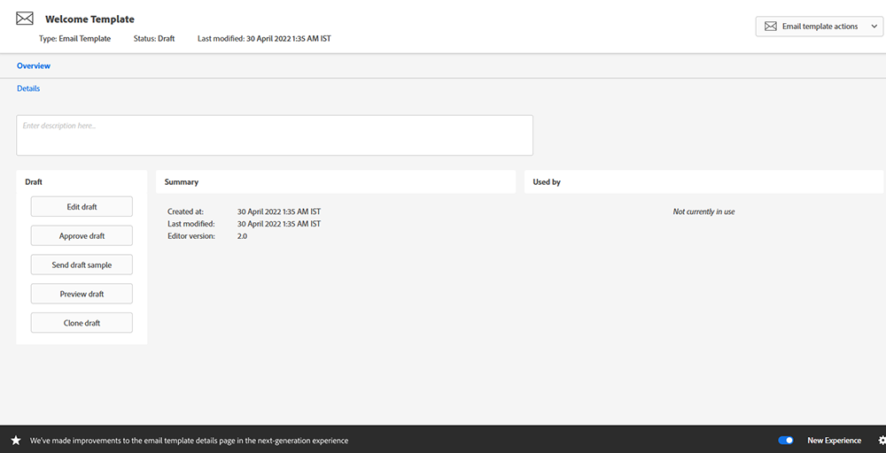
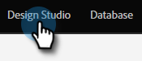

# Umschalten {#toggle-switch}

Mit dem Umschalter können Sie zwischen der klassischen Benutzeroberfläche von Marketo und dem Marketo Engage der nächsten Generation wechseln. Es ist in allen unten hervorgehobenen Bereichen verfügbar. Ab der Version Mai 2022 wird das Erlebnis der nächsten Generation standardmäßig aktiviert.

>[!NOTE]
>
>Wenn die Option Umschalter aktiviert ist, werden alle vorhandenen Workflows automatisch gespeichert, bevor die UI geändert wird. Wenn ein Vorgang bereits ausgeführt wird (z. B.: Ein Asset wird derzeit genehmigt), erhalten Sie eine Fehlermeldung, die darauf hinweist, dass es sich um ein Asset handelt, das nach Abschluss des Vorgangs erneut geprüft werden sollte.

## Aktivieren des Umschalters für einzelne Rollen {#enable-the-toggle-switch-for-individual-roles}

Aktivieren Sie den Umschalter für einzelne Rollen oder alle Rollen. So geht es.

1. Klicken Sie im Marketo Engage auf **Admin**.

   

1. Klicken **Neues Erlebnis**.

   

1. Wählen Sie die Rollen aus, die Sie auf den Umschalter zugreifen möchten.

   

## Listenansicht der Landingpage {#landing-page-list-view}

Die Listenansicht der nächsten Generation der Einstiegsseite bietet Suchfilter und die Möglichkeit, Massenaktionen auf der Einstiegsseite durchzuführen.

1. Wählen Sie in Marketo **Design Studio**.

   

1. Auswählen **Landing Pages**.

   

1. Klicken Sie unten rechts auf der Seite auf das **Neues Erlebnis** umschalten.

   

Das neue Erlebnis wird geladen.

## Detailansicht der Landingpage {#landing-page-details-view}

1. Suchen und wählen Sie in Marketo Ihre Landingpage aus.

   

1. Klicken Sie unten rechts auf der Seite auf das **Neues Erlebnis** umschalten.

   

Das neue Erlebnis wird geladen.

## Formulardetailseite {#form-details-page}

1. Suchen und wählen Sie in Marketo Ihr Formular aus.

   

1. Klicken Sie unten rechts auf der Seite auf das **Neues Erlebnis** umschalten.

   

Das neue Erlebnis wird geladen.

## Formularlistenansicht {#form-list-view}

1. Wählen Sie in Marketo **Design Studio**.

   

1. Auswählen **Forms**.

   

1. Klicken Sie unten rechts auf der Seite auf das **Neues Erlebnis** umschalten.

   

Das neue Erlebnis wird geladen.

## Detailansicht der E-Mail-Vorlage {#email-template-details-view}

1. Wählen Sie in Marketo **Design Studio**.

   

1. Wählen Sie die gewünschte E-Mail-Vorlage aus.

   

1. Klicken Sie unten rechts auf der Seite auf das **Neues Erlebnis** umschalten.

   

Das neue Erlebnis wird geladen.

## Ansicht mit E-Mail-Details {#email-details-view}

1. Suchen und wählen Sie in Marketo Ihre E-Mail aus.

   

1. Klicken Sie unten rechts auf der Seite auf das **Neues Erlebnis** umschalten.

   

Das neue Erlebnis wird geladen.

## E-Mail-Listenansicht {#email-list-view}

Die nächste Generation der E-Mail-Listenansicht bietet Suchfilter und die Möglichkeit, E-Mail-Massenaktionen durchzuführen.

1. Wählen Sie in Marketo **Design Studio**.

   

1. Auswählen **E-Mails**.

   

1. Klicken Sie unten rechts auf der Seite auf das **Neues Erlebnis** umschalten.

   

Das neue Erlebnis wird geladen.

## Aktivieren für alle Funktionen {#enable-for-all-features}

Sie haben die Möglichkeit, die Benutzeroberfläche der nächsten Generation von Marketo für alle verfügbaren Funktionen (aktuell und in Kürze) manuell zu aktivieren.

1. In einem Bereich, der derzeit über den Umschalter verfügt (in diesem Beispiel befinden wir uns in [Formulardetailseite](#form-details-page)), klicken Sie auf das Zahnradsymbol unten rechts auf der Seite.

   

1. Auswählen **Aktivieren für alle verfügbaren Funktionen** und klicken Sie auf **OK**.

   
