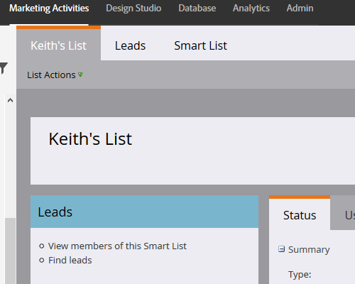
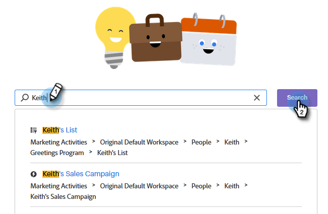

# Verwenden der globalen Suche {#using-the-global-search}

Die leistungsstarke globale Suche bietet Ihnen viele Möglichkeiten. Lass uns über sie gehen.

## Automatische Vervollständigung der Ergebnisse {#autocomplete-results}

Manchmal zeigt Ihnen die automatische Vervollständigung schnell, was Sie suchen.

1. Klicken Sie im globalen Navigationsbereich auf **Suche**.

   

1. Geben Sie Text für Ihr Asset ein.

   

1. Die Suchergebnisse werden automatisch gefüllt. Sie können auf eine beliebige Stelle in einem der Breadcrumbs klicken, um direkt zu diesem Element zu gelangen.

   

1. In diesem Beispiel werden wir direkt zu der Liste geführt, nach der wir suchen. Klicken Sie auf den Namen der Liste.

   

Sie werden direkt zur gewünschten Liste gebracht.

## Globale Suchergebnisse {#global-search-results}

Verwenden Sie die vollständige Suche, wenn die Ergebnisse der automatischen Vervollständigung nicht zeigen, was Sie suchen.

1. Klicken Sie im globalen Navigationsbereich auf **Suche**.

   

1. Geben Sie Text für Ihr Asset ein und klicken Sie auf **Suche**.

   

1. Die Seite &quot;Globale Suchergebnisse&quot;wird geöffnet.

   

<table> 
 <tbody>
  <tr>
   <td>3</td> 
   <td>Zuerst (oder nur) Seite mit allen Suchergebnissen klicken Sie an eine beliebige Stelle in einem der Breadcrumbs, um direkt zu diesem Bereich zu diesem Bereich geführt werden</td> 
  </tr>
  <tr>
   <td>2</td> 
   <td>Datum/Uhrzeit der Erstellung/letzten Änderung des Elements</td> 
  </tr>
  <tr>
   <td>3</td> 
   <td>Wählen Sie einen bestimmten Hauptmarketo-Abschnitt aus, der durchsucht werden soll, oder suchen Sie alle gleichzeitig</td> 
  </tr>
  <tr>
   <td>4</td> 
   <td>Implementierung von fokussierten Filtern zur Eingrenzung der Suchergebnisse</td> 
  </tr>
 </tbody>
</table>

OPTIONALER SCHRITT: Um die Filterung zu verwenden, wählen Sie Ihre Optionen aus und klicken Sie auf **Apply**.

OPTIONALER SCHRITT: Um die Details eines Elements anzuzeigen, klicken Sie auf den &quot;Leerraum&quot;seiner Zeile.

OPTIONALER SCHRITT: Um direkt zum letzten Element in einem Breadcrumb zu gelangen, klicken Sie darauf, ODER, bewegen Sie den Mauszeiger über den &quot;Leerraum&quot; in der Zeile, bis das Symbol unten erscheint, und klicken Sie darauf.

