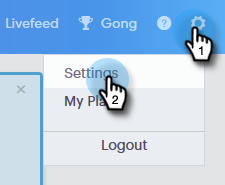
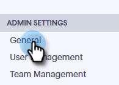
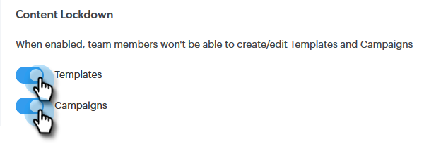

# Inhaltssperre {#content-lockdown}

Durch die Aktivierung der Inhaltssperre können Benutzende ohne Administratorrechte keine Vorlagen und/oder Kampagnen bearbeiten. Benutzende können Inhalte nicht freigeben, klonen, bearbeiten oder löschen. Außerdem haben sie keine Möglichkeit, Vorlagen zu archivieren.

>[!NOTE]
>
>Benutzer **können** Inhalt einer E-Mail zum Zeitpunkt des Versands oder beim Starten einer Kampagne bearbeiten.

1. Klicken [!UICONTROL  in &quot;]&quot; auf das Einstellungssymbol und wählen Sie &quot;**[!UICONTROL &quot;]**.

   

1. Klicken [!UICONTROL  unter &quot;]&quot; auf **[!UICONTROL Allgemein]**.

   

1. Scrollen Sie nach unten [!UICONTROL Content Lockdown]. Wenn Sie einen der Regler aktivieren _wird_ Möglichkeit für Ihre Team-Mitglieder zum Erstellen/Bearbeiten von Vorlagen und/oder Kampagnen deaktiviert.

   
