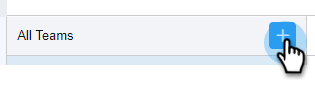

# Erstellen eines Unterteams {#create-a-sub-team}

## Erstellen eines Unterteams {#create-a-sub-team-1}

1. Klicken Sie auf das Zahnradsymbol und wählen Sie **Einstellungen** aus.

   

1. Wählen Sie unter „Admin-Einstellungen **die Option „Team-Verwaltung** aus.

   

1. Klicken Sie neben Alle Teams auf das **+**.

   

1. Geben Sie einen Team-Namen (und optional eine Beschreibung) ein und klicken Sie auf **Erstellen**.

   

   >[!NOTE]
   >
   >Sie können jetzt Vorlagen, Kampagnen und Gruppen für dieses Team freigeben.

## Personen zu Ihrem Unterteam hinzufügen {#add-people-to-your-sub-team}

1. Wählen Sie noch in Team Management die Gruppe **Alle** aus.

   

1. Suchen Sie die Benutzer, die Sie Ihrem Unterteam hinzufügen möchten, und aktivieren Sie deren Kontrollkästchen.

   

1. Klicken Sie **Ausgewählte zu Teams hinzufügen**.

   

1. Klicken Sie auf die Dropdown-Liste und wählen Sie Ihr(e) gewünschte(s) Team(s) aus.

   

1. Klicken Sie abschließend **Zu Teams hinzufügen**.

   
