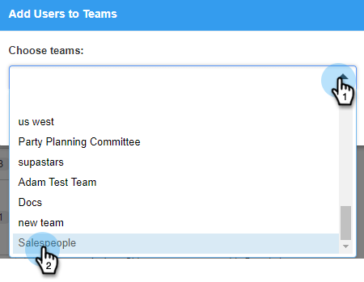

# Erstellen eines Unterteams {#create-a-sub-team}

## Erstellen eines Unterteams {#create-a-sub-team-1}

1. Klicken Sie auf das Zahnradsymbol und wählen Sie **Einstellungen**.

   

1. Wählen Sie unter &quot;Admin-Einstellungen&quot;die Option **Teamverwaltung**.

   

1. Klicken Sie neben Alle Teams auf **+**.

   

1. Geben Sie einen Teamnamen (und eine optionale Beschreibung) ein und klicken Sie auf **Erstellen**.

   

   >[!NOTE]
   >
   >Sie können nun Vorlagen, Kampagnen und Gruppen für dieses Team freigeben.

## hinzufügen Personen in Ihr Unterteam {#add-people-to-your-sub-team}

1. Wählen Sie in Team Management weiterhin die Gruppe **Alle** aus.

   

1. Suchen Sie die Benutzer, die Sie Ihrem Unterteam hinzufügen möchten, und aktivieren Sie deren Kontrollkästchen.

   

1. Klicken Sie auf **Hinzufügen Ausgewählte Teams**.

   

1. Klicken Sie auf die Dropdownliste und wählen Sie die gewünschten Teams aus.

   

1. Klicken Sie abschließend auf **Hinzufügen auf Teams**.

   
