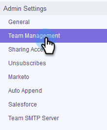

# Teammitglieder einladen {#invite-team-members}

Das Hinzufügen von Teammitgliedern ist schnell und einfach!

1. Klicken Sie auf das Zahnradsymbol und wählen Sie **Einstellungen**.

   

1. Wählen Sie unter &quot;Admin-Einstellungen&quot;die Option **Teamverwaltung**.

   

1. Klicken Sie auf **Neuen Benutzer einladen**.

   

1. Geben Sie die E-Mail-Adressen der Personen ein, die Sie hinzufügen möchten, und klicken Sie auf **Weiter**.

   

   >[!NOTE]
   >
   >Standardmäßig werden alle neuen Mitglieder dem Team &quot;Alle&quot;hinzugefügt.

1. Klicken Sie auf **OK**.

   

