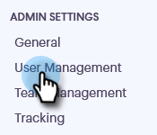
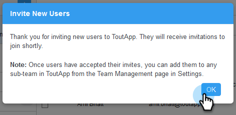

# Einladen von Benutzenden {#invite-users}

Das Hinzufügen von Benutzern ist schnell und einfach!

1. Klicken Sie auf das Zahnradsymbol und wählen Sie **[!UICONTROL Einstellungen]** aus.

   

1. Wählen [!UICONTROL &#x200B; unter &quot;]&quot; die Option **[!UICONTROL Benutzerverwaltung]** aus.

   

1. Klicken Sie **[!UICONTROL Benutzer einladen]**.

   

1. Geben Sie die E-Mail-Adressen der Kontakte ein, die Sie hinzufügen möchten, und klicken Sie auf **[!UICONTROL Weiter]**.

   

   >[!NOTE]
   >
   >Standardmäßig werden alle neuen Mitglieder dem Team Alle hinzugefügt.

1. Klicken Sie auf **[!UICONTROL OK]**.

   
