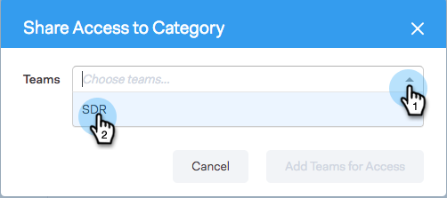
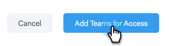

# Freigabeeinstellungen {#sharing-settings}

Verwalten Sie Ihre Vorlagen besser, indem Sie einschränken, was Benutzende mit welchen Kategorien teilen können.

Bei der ersten Erstellung Ihres Sales Connect-Kontos [!UICONTROL &#x200B; die Freigabeeinstellungen &#x200B;] aktiviert. Dadurch haben Ihre Kontoadministratoren die Möglichkeit, Ihre Vorlagenkategorien zu erstellen und zu organisieren, bevor sie die Schleusentore öffnen, und Benutzern die Freigabe von Inhalten in Ihren Team-Kategorien zu ermöglichen.

Wenn [!UICONTROL Freigabeeinstellungen] aktiviert sind, können nur Administratoren Inhalte in Kategorien freigeben, es sei denn, einem Team oder allen Benutzern werden Freigabeberechtigungen gewährt. Wenn [!UICONTROL Freigabeeinstellungen] deaktiviert ist, gibt es keine Einschränkungen und alle Benutzer können Inhalte für beliebige Vorlagenkategorien freigeben.

## Konfigurieren der Freigabeeinstellungen {#configure-your-sharing-settings}

1. Wechseln Sie in [Web-](https://toutapp.com/login)) zur Seite [!UICONTROL Einstellungen] .

   

1. Wählen [!UICONTROL &#x200B; unter „Admin] die Option **[!UICONTROL Zugriff freigeben]** aus.

   

1. Stellen Sie sicher **[!UICONTROL dass „Freigabeeinstellungen]** aktiviert sind. Das bedeutet, dass standardmäßig nur Administratoren Vorlagen in Ihren Vorlagenkategorien freigeben können.

   

1. Wählen Sie die Vorlagenkategorie aus, die Sie konfigurieren möchten.

   

1. Klicken Sie **[!UICONTROL Teams für Zugriff hinzufügen]**.

   

1. Wählen Sie die Teams aus, die Sie hinzufügen möchten.

   

   >[!NOTE]
   >
   >Wenn Sie keine Teams sehen, müssen Sie zu Team Management gehen und ein Team von Benutzern erstellen.

1. Klicken Sie **[!UICONTROL Teams für Zugriff hinzufügen]** um zu speichern.

   

1. Nachdem Ihr Team hinzugefügt wurde, können Sie festlegen, dass nur Team-Administratoren bzw. -Administratorinnen für alle Benutzenden in diesem Team freigeben dürfen. In diesem Beispiel haben wir allen Benutzenden des SDR-Teams gemeinsamen Zugriff gewährt.

   
