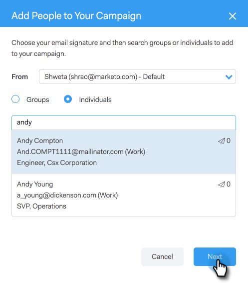

# Zu Marketing-Kampagne hinzufügen {#add-to-marketing-campaign}

>[!PREREQUISITES]
>
>[Sichtbarmachen einer Kampagne für Vertriebsbenutzer](/help/marketo/product-docs/marketo-sales-connect/marketo/make-a-campaign-visible-to-sales-connect-users.md)

## Hinzufügen von Personen zu einer Kampagne {#add-individuals-to-a-campaign}

>[!NOTE]
>
>Damit eine Person von Sales Connect aus einer Marketo-Kampagne hinzugefügt werden kann, muss Sales Connect über die Marketo-Lead-ID der Person verfügen.

1. Klicken Sie auf die Registerkarte **Personen** .

   

1. Suchen Sie die Kontakte, die Sie hinzufügen möchten.

   

1. Aktivieren Sie das Kontrollkästchen, um Ihre Kontakte auszuwählen.

   

1. Klicken Sie auf **Auswahl zur Kampagne hinzufügen**.

   

1. Da Sie eine Marketing-Kampagne hinzufügen, überspringen Sie die Auswahl einer &quot;Von&quot;-Adresse. Sie können jedoch weitere Kontakte hinzufügen. Klicken Sie bei Bedarf auf Individuen und geben Sie diese ein. Klicken Sie abschließend auf **Weiter** .

   

1. Klicken Sie auf **Marketing-Kampagne**.

   

1. Klicken Sie auf das Dropdown-Menü Arbeitsbereiche und wählen Sie den Arbeitsbereich aus, der die Kampagne enthält, der die Gruppe hinzugefügt werden soll.

   

   >[!NOTE]
   >
   >Wenn der gewünschte Arbeitsbereich nicht angezeigt wird, stellen Sie sicher, dass Ihr Administrator ihn über Ihre Marketo Team Access-Seite bereitstellt.

1. Wählen Sie die gewünschte Kampagne aus und klicken Sie auf **Weiter**.

   

1. Ihnen werden die Kontakte angezeigt, die sich qualifizieren. Klicken Sie auf **Start** , um sie hinzuzufügen.

   

## Eine Gruppe zu einer Kampagne hinzufügen {#add-a-group-to-a-campaign}

1. Klicken Sie auf die Registerkarte **Personen** .

   

1. Wählen Sie unter Meine Gruppen die Gruppe aus, die Sie einer Kampagne hinzufügen möchten.

   

1. Klicken Sie auf **Gruppe zur Kampagne hinzufügen**.

   

1. Da Sie eine Marketing-Kampagne hinzufügen, überspringen Sie die Auswahl einer &quot;Von&quot;-Adresse. Sie können jedoch weitere Kontakte hinzufügen. Klicken Sie bei Bedarf auf Individuen und geben Sie diese ein. Klicken Sie abschließend auf **Weiter** .

   

1. Wählen Sie **Marketing-Kampagne** aus.

   

   >[!NOTE]
   >
   >Damit eine Person von Sales Connect aus einer Marketo-Kampagne hinzugefügt werden kann, muss Sales Connect über die Marketo-Lead-ID der Person verfügen.

1. Klicken Sie auf das Dropdown-Menü Arbeitsbereiche und wählen Sie den Arbeitsbereich aus, der die Kampagne enthält, der die Gruppe hinzugefügt werden soll.

   

   >[!NOTE]
   >
   >Wenn der gewünschte Arbeitsbereich nicht angezeigt wird, stellen Sie sicher, dass Ihr Administrator ihn über Ihre Marketo Team Access-Seite bereitstellt.

1. Wählen Sie die gewünschte Kampagne aus und klicken Sie auf **Weiter**.

   

1. Ihnen werden die Kontakte angezeigt, die sich qualifizieren. Klicken Sie auf **Start** , um sie hinzuzufügen.

   
