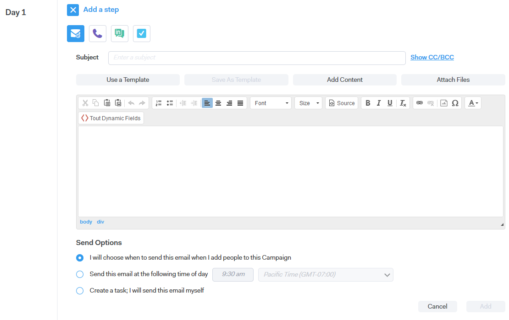

# Kampagnen-Schritttypen {#campaign-step-types}

Beim Hinzufügen eines Schritts zu Ihrer Kampagne haben Sie vier Möglichkeiten.

## E-Mail {#email}

Erstellen Sie eine neue E-Mail oder verwenden Sie eine bereits vorhandene Vorlage.

| **Vorlage verwenden** | Eine der bereits vorhandenen Vorlagen auswählen |
|---|---|
| **Als Vorlage speichern** | Speichern Sie die soeben erstellte E-Mail als neue Vorlage |
| **Inhalt hinzufügen** | Laden Sie eine Datei auf unseren Server hoch und erhalten Sie eine URL (die auf den Inhalt verweist), die in Ihrer E-Mail verfolgt werden kann |
| **Dateien anhängen** | Datei von Ihrem Computer an die E-Mail anhängen (Größenbeschränkung von 23 MB) |

>[!TIP]
>
>Erfahren Sie mehr über Ihre [Versandoptionen](/help/marketo/product-docs/marketo-sales-connect/campaigns/understanding-send-options.md).

## Anruf {#call}

Richten Sie eine Erinnerung ein, um einem Kontakt per Telefon nachzugehen. Sie können auch Notizen speichern, um sie während des Anrufs als Talktrack zu verwenden.

## InMail {#inmail}

Die Nachverfolgung über mehrere Kanäle ist eine hervorragende Möglichkeit, um eine Verbindung mit Leads herzustellen. Bei InMail-Aufgaben können Sie eine Erinnerung einrichten, um über LinkedIn Kontakt aufzunehmen.

## Benutzerdefinierte Aufgabe {#custom-task}

Verwenden Sie benutzerdefinierte Aufgaben, wenn die oben genannten Optionen nicht anwendbar sind. Sie können beispielsweise einen Kollegen per E-Mail einladen, einem Lead nachzugehen.

