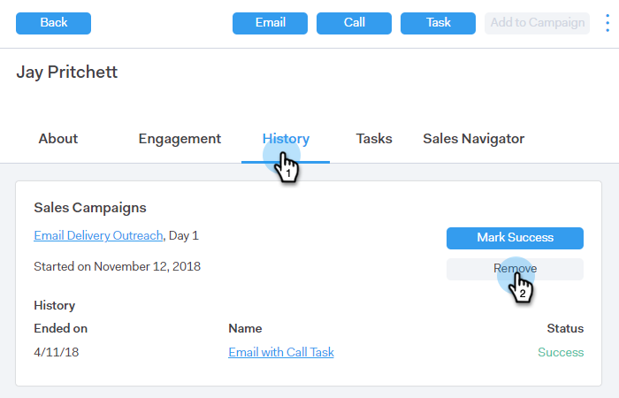

# Personen aus einer Kampagne entfernen {#remove-people-from-a-campaign}

Sie können eine Kampagne automatisch senden, wenn ein Empfänger antwortet. Außerdem können Sie festlegen, dass die Kampagne für diesen Empfänger als „Erfolg“ markiert wird.

Um dies einzurichten, nachdem Sie Ihre Kampagne erstellt haben, aktivieren Sie einfach die Kontrollkästchen Abmelden im Abschnitt Einstellungen der Registerkarte Kampagnen . Beide Optionen beenden die Kampagne, und Ihr Empfänger erhält keine weiteren E-Mails von Ihnen. Dazu ist ein Tracking der Antworten erforderlich.

Darüber hinaus können Sie Personen aus der Kampagne selbst entfernen, Personen aus einer Kampagne auf der Seite Personen entfernen und eine ganze Gruppe von Personen entfernen. Sehen wir uns alle drei Methoden unten an.

## Eine Person direkt aus einer Kampagne entfernen {#remove-a-person-directly-from-a-campaign}

1. Klicken Sie in Sales Connect auf die Registerkarte **Kampagnen**.

   

1. Suchen Sie Ihre Kampagne und wählen Sie sie aus.

   

1. Ihre Kampagne wird auf der rechten Seite angezeigt. Klicken Sie auf eine beliebige Stelle, um sie zu öffnen.

   

1. Suchen Sie die zu entfernende Person und klicken Sie auf **Entfernen**.

   

1. (OPTIONALER SCHRITT) Sie können auch mehrere Personen gleichzeitig entfernen, indem Sie die Kontrollkästchen neben ihren Namen aktivieren und oben auf **Entfernen** klicken.

   

## Entfernen einer Person aus einer Kampagne auf der Seite „Personen“ {#remove-a-person-from-a-campaign-within-the-people-page}

1. Klicken Sie in Sales Connect auf die Registerkarte **Personen**.

   

1. Suchen Sie die Person, die Sie entfernen möchten, und wählen Sie sie aus.

   

1. Das zugehörige Bedienfeld „Personendetailansicht“ wird auf der rechten Seite geöffnet. Klicken Sie auf **Registerkarte** Verlauf“, gefolgt von der Schaltfläche **Entfernen**.

   

## Entfernen einer Personengruppe aus einer Kampagne {#remove-a-group-of-people-from-a-campaign}

1. Klicken Sie in Sales Connect auf die Registerkarte **Personen**.

   

1. Suchen Sie Ihre Gruppe und wählen Sie sie unter **Meine Gruppen** aus.

   

1. Wählen Sie die Personen aus, die Sie entfernen möchten.

   

1. Klicken Sie auf **Aktionen** und wählen Sie **Auswahl aus Kampagne entfernen**.

   
