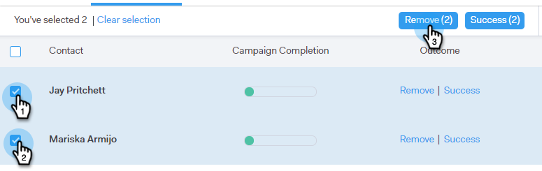
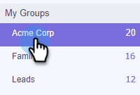

# Personen aus einer Kampagne entfernen {#remove-people-from-a-campaign}

Sie können eine Kampagne automatisch beenden, wenn ein Empfänger antwortet. Und Sie können festlegen, dass die Kampagne für diesen Empfänger als &quot;Erfolg&quot;gekennzeichnet wird.

Um dies einzurichten, aktivieren Sie nach der Erstellung Ihrer Kampagne im Tab Kampagnen im Bereich Einstellungen die Option Abonnement kündigen . Beide Optionen beenden die Kampagne und Ihr Empfänger erhält keine E-Mails mehr von Ihnen. Sie müssen über Antwort-Tracking verfügen, damit dies funktioniert.

Darüber hinaus können Sie Personen aus der Kampagne selbst entfernen, Personen aus einer Kampagne auf der Seite &quot;Personen&quot;entfernen und eine ganze Gruppe von Personen entfernen. Sehen wir uns alle drei Methoden unten an.

## Person direkt aus einer Kampagne entfernen {#remove-a-person-directly-from-a-campaign}

1. Klicken Sie in Sales Connect auf die Registerkarte **Kampagnen** .

   

1. Suchen Sie Ihre Kampagne und wählen Sie sie aus.

   

1. Ihre Kampagne wird rechts angezeigt. Klicken Sie auf eine beliebige Stelle, um sie zu öffnen.

   

1. Suchen Sie die Person, die Sie entfernen möchten, und klicken Sie auf **Entfernen**.

   

1. (OPTIONALER SCHRITT) Sie können auch mehrere Personen gleichzeitig entfernen, indem Sie auf die Kontrollkästchen neben ihrem Namen klicken und oben auf die Schaltfläche **Entfernen** klicken.

   

## Entfernen einer Person aus einer Kampagne auf der Seite &quot;Personen&quot; {#remove-a-person-from-a-campaign-within-the-people-page}

1. Klicken Sie in Sales Connect auf die Registerkarte **Personen** .

   

1. Suchen und wählen Sie die Person aus, die Sie entfernen möchten.

   

1. Das Bedienfeld &quot;Personendetailansicht&quot;wird rechts geöffnet. Klicken Sie auf die Registerkarte **Verlauf** und dann auf die Schaltfläche **Entfernen** .

   

## Eine Personengruppe aus einer Kampagne entfernen {#remove-a-group-of-people-from-a-campaign}

1. Klicken Sie in Sales Connect auf die Registerkarte **Personen** .

   

1. Suchen und wählen Sie Ihre Gruppe unter **Meine Gruppen** aus.

   

1. Wählen Sie die Personen aus, die entfernt werden sollen.

   

1. Klicken Sie auf **Aktionen** und wählen Sie **Auswahl aus Kampagne entfernen**.

   
