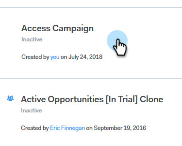

# Überspringen von Wochenenden {#skip-weekends}

Beim Automatisieren einer Kampagne möchten Sie wahrscheinlich nicht, dass Ihre E-Mails an einem Samstag oder Sonntag gesendet werden. Andernfalls können Sie das Wochenende überspringen.

1. Klicken Sie [!DNL Sales Connect] auf die Registerkarte **[!UICONTROL -Kampagnen]** .

   

1. Suchen Sie Ihre Kampagne und wählen Sie sie aus.

   

1. Klicken Sie auf **[!UICONTROL Einstellungen]**.

   

1. Aktivieren Sie das **[!UICONTROL Wochenenden überspringen]**.

   

   >[!NOTE]
   >
   >Ohne Wochenenden überspringen werden Ihre E-Mails auf der Grundlage einer regulären 7-Tage-Woche geplant.
