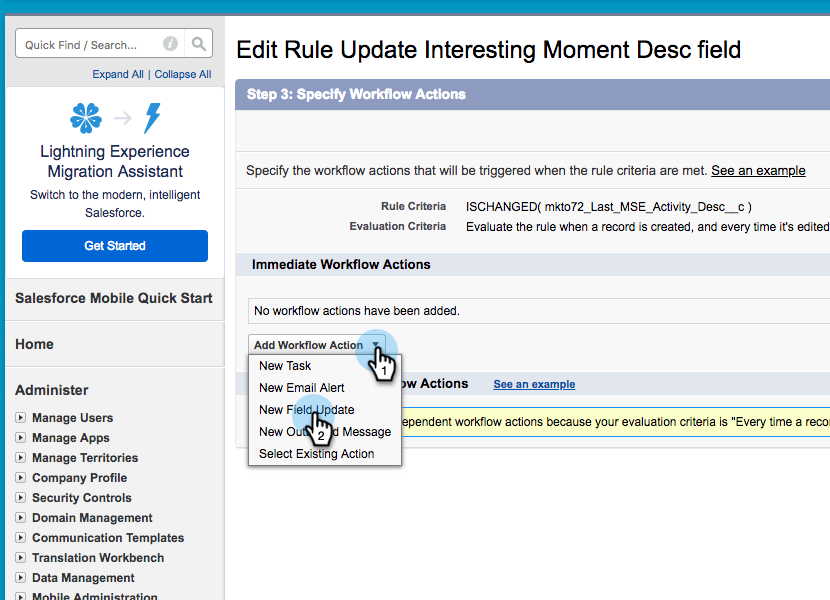

# Erstellen von Workflow-Regeln in Salesforce {#creating-workflow-rules-in-salesforce}

Wenn Sie Marketo Sales Insight (MSI) und Marketo Sales Connect (MSC) parallel verwenden, wird die Funktion &quot;MSI Best Bets&quot;in Salesforce nicht aktualisiert. Alle anderen MSI-Funktionen funktionieren wie gewohnt (Betrachten interessanter Momente im iFrame, Senden von E-Mails, Hinzufügen zu Kampagnen usw.). In diesem Artikel finden Sie eine Problemumgehung, damit Best Bets wieder funktionieren.

>[!NOTE]
>
>Dies betrifft nur Kunden, die **both** MSI und MSE, und die die Best-Bets-Funktion in MSI verwenden möchten. Wenn Sie keine Best Bets benötigen/verwenden, können Sie dies ignorieren.

## Erste Schritte {#getting-started}

Die Problemumgehung umfasst das Erstellen neuer Workflow-Regeln, um Werte aus neuen MSE-Feldern in die alten MSI-Felder zu kopieren. Sie müssen vier Workflow-Regeln für das Kontaktobjekt und dieselben vier Workflow-Regeln für das Lead-Objekt in Ihrer eigenen Salesforce-Instanz erstellen. Dies erfordert möglicherweise CRM-Administratorrechte (abhängig von Ihrer Rolle und Einrichtung im CRM).

Nachfolgend finden Sie die empfohlenen Namen der Workflow-Regeln und eine Beschreibung der einzelnen Regeln. Diese gelten für das Kontakt- und das Lead-Objekt:

<table> 
 <colgroup> 
  <col> 
  <col> 
 </colgroup> 
 <tbody> 
  <tr> 
   <td>Aktualisieren des interessanten Moment Desc-Felds</td> 
   <td>
Kopieren aus: Letzte Marketo Interaktion Desc Kopieren nach: Letzter interessanter Moment Desc
</td> 
  </tr> 
  <tr> 
   <td>Feld "Interessanten Moment-Typ aktualisieren"</td> 
   <td>
Kopieren aus: Letzter Marketo-Interaktionstyp Kopieren nach: Letzter interessanter Moment-Typ
</td> 
  </tr> 
  <tr> 
   <td>Feld "Interessante Moment-Quelle aktualisieren"</td> 
   <td>
Kopieren aus: Letzte Marketo-Interaktionsquelle Kopieren nach: Letzte interessante Moment-Quelle
</td> 
  </tr> 
  <tr> 
   <td>Feld für interessantes Datum des Zeitpunkts aktualisieren</td> 
   <td>
Kopieren aus: Letztes Interaktionsdatum der Marketo Kopieren nach: Letztes interessantes Datum
</td> 
  </tr> 
 </tbody> 
</table>

## Anweisungen {#instructions}

1. Nach dem Klicken **Einrichtung**, suchen Sie nach **Workflow** und wählen Sie **Workflow-Regeln**.

   

1. Auswählen **Neue Regel**.

   

1. Klicken Sie auf die Dropdown-Liste Objekt und wählen Sie **Lead** Klicken Sie auf **Nächste**.

   

1. Geben Sie als Regelnamen &quot;Update Interest Moment Desc Field&quot;ein. Optionsfeld auswählen **erstellt wurde und jedes Mal, wenn sie bearbeitet wird**. Wählen Sie in der Dropdownliste Regelkriterien die Option **Formel wird als &quot;true&quot;ausgewertet**. Suchen Sie nach der ISCHANGED-Funktion und wählen Sie sie aus. Markieren Sie dann den Standardwert des Felds und klicken Sie auf **Feld einfügen**.

   

1. Wählen Sie im Popup &quot;Feld einfügen&quot;die Option **Letzte Marketo Interaktion Desc** und klicken Sie auf **Einfügen**.

   

1. Klicken **Speichern und Weiter**.

   

1. Wählen Sie in der Dropdown-Liste Workflow-Aktion hinzufügen die Option **Neue Feldaktualisierung**.

   

1. Geben Sie im Feld Name die Option &quot;Update Interest Moment Desc Field&quot; ein (der eindeutige Name wird automatisch generiert). Wählen Sie im Dropdown-Menü Zu aktualisierendes Feld die Option **Letzter interessanter Moment Desc**. Wählen Sie die **Verwenden Sie eine Formel zum Festlegen eines neuen Werts** Optionsfeld und klicken Sie dann auf **Formel-Editor anzeigen**.

   

1. Klicken Sie auf **Feld einfügen** Schaltfläche.

   

1. Auswählen **Letzte Marketo Interaktion Desc** und klicken Sie auf **Einfügen**. Klicken Sie auf der nächsten Seite auf **Speichern**.

   

1. Klicken **Fertig**.

   

1. Klicken **Aktivieren** , um die Workflow-Regel zu aktivieren.

   

   Nach dem letzten Schritt können Sie die Workflow-Regel für die anderen Felder klonen, die im Abschnitt Erste Schritte aufgelistet sind: Desc, Typ, Quelle, Datum. Nachdem Sie die vier Workflow-Regeln im Kontaktobjekt abgeschlossen haben, wiederholen Sie dies für das Lead-Objekt.
