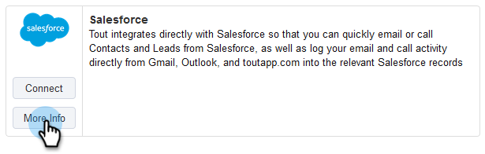

# Verbinden von Sales Connect mit Ihrer Salesforce Sandbox {#how-to-connect-sales-connect-to-your-salesforce-sandbox}

>[!PREREQUISITES]
>
>Ihr [!DNL &#x200B; Sales Connect]-Konto kann nicht bereits mit [!DNL Salesforce] verbunden werden, wenn eine Verbindung zur Sandbox hergestellt wird. Ist dies der Fall, [stellen Sie sicher, dass Sie die Verbindung trennen](/help/marketo/product-docs/marketo-sales-connect/crm/salesforce-integration/disconnect-salesforce-from-your-sales-connect-account.md) bevor Sie die Schritte in diesem Artikel befolgen.

1. Klicken Sie [!DNL Sales Connect] oben rechts auf das Zahnradsymbol und dann auf **[!UICONTROL Einstellungen]**.

   

1. Klicken [!UICONTROL &#x200B; unter &quot;]&quot; auf **[!UICONTROL CRM]**.

   

1. Klicken Sie auf der [!DNL Salesforce] auf **[!UICONTROL Weitere Informationen]**.

   

1. Klicken Sie unten auf der Seite auf &quot;**[!UICONTROL mit Sandbox]**.

   

   >[!NOTE]
   >
   >Wenn Sie bereits bei Ihrem [!DNL Salesforce Sandbox]-Konto angemeldet sind, werden Sie zu einer Autorisierungsseite weitergeleitet, auf der Sie den Zugriff zulassen müssen. Wenn Sie noch nicht angemeldet sind, fahren Sie mit Schritt 5 fort.

1. Geben Sie den Benutzernamen und das Passwort Ihres [!DNL Salesforce Sandbox]-Kontos ein.

   

>[!MORELIKETHIS]
>
>[So installieren Sie Anpassungen in Ihrer Salesforce-Sandbox](/help/marketo/product-docs/marketo-sales-connect/crm/salesforce-customization/how-to-install-customizations-in-your-salesforce-sandbox.md)
