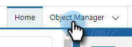
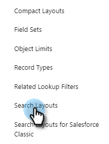
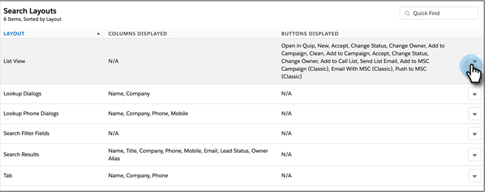

# Marketo Sales Connect von Salesforce Lightning deinstallieren {#uninstall-marketo-sales-connect-from-salesforce-lightning}

So deinstallieren Sie das Marketo Sales Connect-Paket von Ihrem Salesforce-Konto, sobald Sie mit der Verwendung von Sales Insight-Aktionen beginnen.

## Entfernen von Sales Connect-Feldern aus dem Seiten-Layout {#remove-sales-connect-fields-from-page-layout}

1. Klicken Sie in Salesforce Lightning auf das Zahnradsymbol und wählen Sie **Setup**.

   

1. Klicken Sie auf **Objekt-Manager**.

   

1. Scrollen Sie nach unten zu und wählen Sie **Lead** aus.

   

1. Klicken Sie auf **Seiten-Layouts**.

   

1. Klicken Sie **Lead-Layout**.

   

   >[!NOTE]
   >
   >Die Layout-Ansicht Seite bearbeiten wurde in Salesforce Lightning noch nicht aktualisiert.

1. Wählen Sie in der Konsole &quot;**&quot;**. Suchen Sie in der Schnellsuche nach „MSC“. Alle ausgegrauten Felder wurden Ihrem Seiten-Layout hinzugefügt. Sie müssen sie löschen.

   

   >[!NOTE]
   >
   >Wenn keines der Felder ausgegraut ist, bedeutet dies, dass Sie sie nicht zum Seiten-Layout hinzugefügt haben. Sie können diesen Abschnitt überspringen.

1. Scrollen Sie zu dem Abschnitt, der Ihre benutzerdefinierten Felder für Sales Connect enthält.

   

1. Es gibt 10 Arten von MSC-Feldern, die diesem Abschnitt hinzugefügt werden können. Entfernen Sie alle hinzugefügten Felder oder löschen Sie einfach den gesamten Abschnitt.

1. Klicken **abschließend auf** Quick Save“.

   

## Entfernen von Sales Connect-Schaltflächen aus Seiten-Layouts {#remove-sales-connect-buttons-from-page-layouts}

1. Wählen Sie in der Konsole (Schritt 4 oben) **Schaltflächen**. Suchen Sie nach „MSC.“ Alle ausgegrauten Schaltflächen wurden zum Abschnitt für benutzerdefinierte Schaltflächen hinzugefügt. Sie müssen sie löschen.

   

   >[!NOTE]
   >
   >Wenn keine der Schaltflächen ausgegraut ist, bedeutet dies, dass Sie sie nicht hinzugefügt haben. Sie können diesen Abschnitt überspringen.

1. Ziehen Sie die MSC-Schaltflächen per Drag-and-Drop aus dem Abschnitt Benutzerdefinierte Schaltflächen in die Konsole.

   

1. Klicken **abschließend auf** Quick Save“.

   

## Entfernen von Sales Connect-Feldern aus dem Abschnitt „Aktivitätshistorie“ {#remove-sales-connect-fields-from-activity-history-section}

1. Scrollen Sie nach unten auf der Seite zum Abschnitt mit der Liste „Aktivitätsverlauf“ und klicken Sie auf das Schraubenschlüssel -Symbol.

   

1. Wählen Sie im Bereich Ausgewählte Felder die Option Sales Connect-Felder aus und klicken Sie auf den Pfeil Entfernen . Klicken **abschließend** OK“.

   

   >[!NOTE]
   >
   >Die Abkürzung MSE _is_ Sales Connect. Es ist nur der frühere Name, &quot;Marketo Sales Engage“.

1. Klicken Sie **Speichern** wenn Sie mit der Seite Leads fertig sind.

## Entfernen der Sales Connect-Massenaktionsschaltflächen aus der Lead-Listenansicht {#remove-sales-connect-bulk-action-buttons-from-lead-list-view}

1. Klicken Sie in Salesforce Lightning auf das Zahnradsymbol und wählen Sie **Setup**.

   

1. Klicken Sie auf **Objekt-Manager**.

   

1. Scrollen Sie nach unten zu und wählen Sie **Lead** aus.

   

1. Klicken Sie **Suchlayouts**.

   

1. Klicken Sie auf den Pfeil neben Listenansicht und wählen Sie **Bearbeiten** aus.

   

1. Wählen Sie **Zu MSC-Kampagne hinzufügen**, **E-Mail mit MSC** und **Push zu MSC** aus und klicken Sie auf den Pfeil „Entfernen“. Klicken Sie dann auf **Speichern**.

   

Die Schaltflächen in der Lead-Listenansicht sollten nicht mehr angezeigt werden.

## MSC-Konfiguration für Kontakte entfernen {#remove-msc-configuration-for-contacts}

1. Klicken Sie in Salesforce Lightning auf das Zahnradsymbol und wählen Sie **Setup**.

1. Klicken Sie auf **Objekt-Manager**.

1. Scrollen Sie nach unten zu und wählen Sie **Kontakt** aus.

1. Klicken Sie auf **Seiten-Layouts**.

1. Klicken Sie **Kontakt-Layout**.

1. Wiederholen Sie die Schritte aus allen drei Abschnitten.

## MSC-Konfiguration für Opportunity entfernen {#remove-msc-configuration-for-opportunity}

1. Klicken Sie in Salesforce Lightning auf das Zahnradsymbol und wählen Sie **Setup**.

1. Klicken Sie auf **Objekt-Manager**.

1. Scrollen Sie nach unten zu und wählen Sie **Opportunity** aus.

1. Klicken Sie auf **Seiten-Layouts**.

1. Klicken Sie **Opportunity-Layout**.

Die Opportunity-Ansicht hat nur eine Schaltfläche - „E-Mail senden“ und die folgenden Felder:

## MSC-Konfiguration für Konto entfernen {#remove-msc-configuration-for-account}

1. Klicken Sie in Salesforce Lightning auf das Zahnradsymbol und wählen Sie **Setup**.

1. Klicken Sie auf **Objekt-Manager**.

1. Scrollen Sie nach unten zu und wählen Sie **Konto** aus.

1. Klicken Sie auf **Seiten-Layouts**.

1. Klicken Sie **Konto-Layout**.

Die Kontoansicht enthält nur eine Schaltfläche „E-Mail senden“ und die folgenden Felder:

## Marketo-Verkaufsausgang entfernen {#remove-marketo-sales-outbox}

1. Klicken Sie in Salesforce auf die Registerkarte **+** am oberen Bildschirmrand.

1. Klicken Sie **Meine Registerkarten anpassen**.

1. Wählen Sie rechts die Option Marketo Sales Outbox aus. Klicken Sie auf den Pfeil Entfernen und dann auf **Speichern**.

## Sales Connect-Paket löschen {#delete-sales-connect-package}

Nachdem Sie alle Objekte aus Ihrem Salesforce-Konto entfernt haben, führen Sie die folgenden Schritte aus.

1. Klicken Sie in Salesforce Lightning auf das Zahnradsymbol und wählen Sie **Setup**.

1. Geben Sie im Feld „Schnellsuche“ „Apex-Klassen“ ein.

1. Klicken Sie **allen** „MarketoSalesConnectionCustomization“ oder „MarketoSalesEngageCustomization“ auf der Liste auf „Löschen“.

Das war’s schon!

Im Folgenden finden Sie eine Liste aller Objekte, die aus Ihrer Salesforce-Instanz entfernt werden müssen:

## Sales Connect-Anpassungsdetails {#sales-connect-customization-details}

<table>
 <tr>
  <th>Benutzerdefinierte Aktivitätsfelder</th>
  <th>Beschreibung</th>
  <th>Typ</th>
  <th>Datentyp</th>
 </tr>
 <tr>
  <td>Lokale Präsenz-ID des MSC-Aufrufs</td>
  <td>Als Benutzer kann ich „Lokale Präsenz“ als Option auswählen, wenn ich Anrufe vom MSC-Telefon tätige. Eingehende Anrufe zeigen eine lokale Nummer für den Empfänger an</td>
  <td>Aktivität</td>
  <td>Text</td>
 </tr>
 <tr>
  <td>MSC Call Recording URL</td>
  <td>Anrufe können aufgezeichnet werden und ein Link für die Aufzeichnung wird hier protokolliert. </td>
  <td>Aktivität</td>
  <td>Text</td>
 </tr>
 <tr>
  <td>MSC-Kampagne</td>
  <td>Loggt den Namen der MSC-Kampagne, auf der sich der Kontakt/Lead befindet</td>
  <td>Aktivität</td>
  <td>Text</td>
 </tr>
 <tr>
  <td>MSC-Kampagnen-URL</td>
  <td>Protokolliert die URL für die in MSC erstellte Kampagne. Wenn Sie darauf klicken, wird die Kampagne in der MSC-Web-App geöffnet</td>
  <td>Aktivität</td>
  <td>Text</td>
 </tr>
 <tr>
  <td>Aktueller Schritt der MSC-Kampagne</td>
  <td>Wenn sich ein Kontakt/Lead in einer Kampagne befindet, wird in diesem Feld der Name des Schritts protokolliert, in dem er sich derzeit befindet</td>
  <td>Aktivität</td>
  <td>Kontrollkästchen</td>
 </tr>
 <tr>
  <td>MSC-E-Mail-Anhang angesehen</td>
  <td>Protokolliert Daten, wenn eine E-Mail mit einem Anhang gesendet wird, der vom Empfänger angezeigt wird</td>
  <td>Aktivität</td>
  <td>Kontrollkästchen</td>
 </tr>
 <tr>
  <td>MSC-E-Mail angeklickt</td>
  <td>Protokolliert ein Häkchen, wenn der Empfänger auf einen Link in der E-Mail klickt</td>
  <td>Aktivität</td>
  <td>Kontrollkästchen</td>
 </tr>
 <tr>
  <td>MSC-E-Mail beantwortet</td>
  <td>Protokolliert ein Häkchen, wenn der Empfänger auf die E-Mail antwortet</td>
  <td>Aktivität</td>
  <td>Text</td>
 </tr>
 <tr>
  <td>MSC-E-Mail-Status</td>
  <td>Zeigt an, ob eine E-Mail gesendet/in Bearbeitung/nicht zugestellt wurde (Tracking von nicht zugestellten E-Mails hängt vom verwendeten Versandkanal ab)</td>
  <td>Aktivität</td>
  <td>Text</td>
 </tr>
 <tr>
  <td>MSC-E-Mail-Vorlage</td>
  <td>Protokollname der MSC-Vorlage, die in der an den Lead/Kontakt gesendeten E-Mail verwendet wurde</td>
  <td>Aktivität</td>
  <td>Text</td>
 </tr>
 <tr>
  <td>URL der MSC-E-Mail-Vorlage</td>
  <td>Protokolliert die URL in der in MSC erstellten Vorlage. Wenn Sie darauf klicken, wird die Vorlage in der MSC-Web-App geöffnet</td>
  <td>Aktivität</td>
  <td>Text</td>
 </tr>
 <tr>
  <td>MSC-E-Mail-URL</td>
  <td>Wenn Sie auf diese URL klicken, wird die Befehlszentrale in MSC geöffnet und die Registerkarte „Historie der Personendetailansicht“ aufgerufen, auf der die gesendete E-Mail angezeigt werden kann</td>
  <td>Aktivität</td>
  <td>Text</td>
 </tr>
 <tr>
  <td>MSC-E-Mail angesehen</td>
  <td>Protokolliert ein Häkchen, wenn der Empfänger eine E-Mail anzeigt</td>
  <td>Aktivität</td>
  <td>Kontrollkästchen</td>
 </tr>
</table>

<table>
 <tr>
  <th>MSC-Rollup-Protokollierungsfeld</th>
  <th>Beschreibung</th>
  <th>Typ</th>
  <th>Datentyp</th>
 </tr>
 <tr>
  <td>MSC - Letzte Marketing-Interaktion</td>
  <td>Letzte eingehende Interaktion aus Marketing</td>
  <td>
  
Konto
  
Kontakt
  
Lead
  
Opportunity</td>
  <td>Daten und Zeit</td>
 </tr>
 <tr>
  <td>MSC - Datum des letzten Marketing-Engagements</td>
  <td>Zeitstempel der Interaktion mit Marketing</td>
  <td>
  
Konto 
  
Kontakt 
  
Lead 
  
Opportunity</td>
  <td>Daten und Zeit</td>
 </tr>
 <tr>
  <td>MSC - Beschreibung des letzten Marketing-Engagements</td>
  <td>Beschreibung des Projekts</td>
  <td>
  
Konto 
  
Kontakt 
  
Lead 
  
Opportunity</td>
  <td>Text</td>
 </tr>
 <tr>
  <td>MSC - Letzte Marketing-Interaktion mit Source</td>
  <td>Source der Marketing-Interaktionen</td>
  <td>
  
Konto 
  
Kontakt 
  
Lead 
  
Opportunity</td>
  <td>Text</td>
 </tr>
 <tr>
  <td>MSC - Typ der letzten Marketing-Interaktion</td>
  <td>Art der Interaktion (z. B.: Web-Aktivität)</td>
  <td>
  
Konto 
  
Kontakt 
  
Lead 
  
Opportunity</td>
  <td>Text</td>
 </tr>
 <tr>
  <td>MSC - Letzte Aktivität nach Verkauf</td>
  <td>Letzte ausgehende Aktivität des Vertriebsteams</td>
  <td>
  
Konto 
  
Kontakt 
  
Lead 
  
Opportunity</td>
  <td>Daten und Zeit</td>
 </tr>
 <tr>
  <td>MSC - Zuletzt geantwortet</td>
  <td>Letzte E-Mail Antwort an Verkaufs-E-Mail</td>
  <td>
  
Konto 
  
Kontakt 
  
Lead 
  
Opportunity</td>
  <td>Daten und Zeit</td>
 </tr>
 <tr>
  <td>MSC - Aktuelle Verkaufskampagne</td>
  <td>Loggt den Namen der MSC-Kampagne, auf der sich der Kontakt/Lead befindet</td>
  <td>
  
Konto 
  
Kontakt 
  
Lead 
  
Opportunity</td>
  <td>Text</td>
 </tr>
 <tr>
  <td>MSC - Letztes Vertriebsvorhaben</td>
  <td>Letzte eingehende Interaktion aus dem Vertrieb</td>
  <td>
  
Konto
  
Kontakt
  
Lead
  
Opportunity</td>
  <td>Daten und Zeit</td>
 </tr>
 <tr>
  <td>MSC - Opt-out</td>
  <td>Opt-out-Feld</td>
  <td>
  
Konto 
  
Kontakt 
  
Lead 
  
Opportunity</td>
  <td>Kontrollkästchen</td>
 </tr>
</table>

<table>
 <tr>
  <th>MSC-Tasten</th>
  <th>Beschreibung</th>
  <th>Typ</th>
 </tr>
 <tr>
  <td>MSC-E-Mail senden</td>
  <td>Verkaufs-E-Mails von Salesforce senden</td>
  <td>
  
Konto 
  
Kontakt 
  
Lead 
  
Opportunity</td>
 </tr>
 <tr>
  <td>Zu MSC-Kampagne hinzufügen</td>
  <td>Zu MSC-Kampagnen von Salesforce hinzufügen</td>
  <td>
  
Kontakt
  
Lead</td>
 </tr>
 <tr>
  <td>Push an MSC</td>
  <td>Push-Kontakt von Salesforce zu MSC</td>
  <td>
  
Kontakt
  
Lead</td>
 </tr>
 <tr>
  <td>Anruf mit MSC</td>
  <td>Verkaufsanrufe von Salesforce aus tätigen</td>
  <td>
  
Kontakt
  
Lead</td>
 </tr>
</table>

<table>
 <tr>
  <th>MSC-Massenaktionsschaltflächen</th>
  <th>Beschreibung</th>
  <th>Typ</th>
 </tr>
 <tr>
  <td>Zu MSC-Kampagne hinzufügen</td>
  <td>Zu MSC-Kampagnen von Salesforce hinzufügen</td>
  <td>
  
Kontakt
  
Lead</td>
 </tr>
 <tr>
  <td>Push an MSC</td>
  <td>Push-Kontakt von Salesforce zu MSC</td>
  <td>
  
Kontakt
  
Lead</td>
 </tr>
 <tr>
  <td>E-Mail mit MSC</td>
  <td>E-Mail mit MSC aus Salesforce</td>
  <td>
  
Kontakt
  
Lead</td>
 </tr>
</table>
