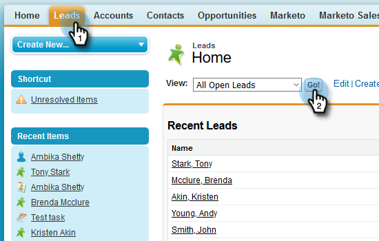

# Verwenden von Massenaktionen in Salesforce Classic {#using-bulk-actions-in-salesforce-classic}

Erfahren Sie, wie Sie Massenaktionen durchführen, z. B. Leads zu einer Kampagne hinzufügen, eine Massen-E-Mail senden oder Leads von Salesforce an Sales Connect senden.

>[!PREREQUISITES]
>
>Aktualisieren Sie auf die neueste Version des Sales Connect-Packages und installieren Sie die Massen-Aktionsschaltflächen in Ihrer Lead-/Kontaktansicht. [Klicken Sie hier, um Anweisungen zu erhalten.](https://s3.amazonaws.com/tout-user-store/salesforce/assets/Marketo+Sales+Engage+For+Salesforce_+Installation+and+Success+Guide.pdf)

>[!NOTE]
>
>Bevor Sie die beschriebenen Schritte durchführen, müssen Sie bei Ihrem Marketo Sales Connect-Konto angemeldet sein.

## Bulk Email {#bulk-email}

1. Klicken Sie in Salesforce auf die Registerkarte **Leads** und dann auf die Schaltfläche **Los**.

   

1. Wählen Sie die gewünschten Leads aus und klicken Sie auf die Schaltfläche **E-Mail mit MSC (Classic)** .

   

1. Daraufhin wird eine MSC-E-Mail angezeigt. Es umfasst die folgenden Funktionen:

   a. Das Feld &quot;An&quot;zeigt &quot;Alle Quittungen&quot;- dies entspricht der Liste der Leads, die Sie in der Lead-Listenansicht ausgewählt haben\
   b. Diese Liste ist im linken Bedienfeld &quot;Bulk Composer&quot;sichtbar - Sie können hier Empfänger hinzufügen/entfernen\
   c. Sie können eine Vorlage auswählen oder eine eigene E-Mail erstellen.\
   d. Sie können eine Vorschau der dynamischen Felder anzeigen, die in Ihre E-Mail eingefügt werden sollen\
   e. Sie können die E-Mail sofort versenden oder einen späteren Versand planen

   

## Zur Kampagne hinzufügen {#add-to-campaign}

1. Klicken Sie in Salesforce auf die Registerkarte **Leads** und dann auf die Schaltfläche **Los**.

   

1. Wählen Sie die gewünschten Leads aus und klicken Sie auf die Schaltfläche **Zu MSC-Kampagne (Classic) hinzufügen** .

   

1. Daraufhin wird das Popup &quot;Personen zu Ihrer Kampagne hinzufügen&quot;angezeigt. Klicken Sie auf **Weiter** und gehen Sie durch den typischen Kampagnenfluss, um eine MSC-Kampagne Trigger.

   

## In Marketo Sales Connect pushen {#push-to-marketo-sales-connect}

1. Klicken Sie in Salesforce auf die Registerkarte **Leads** und dann auf die Schaltfläche **Los**.

   

1. Wählen Sie die gewünschten Leads aus und klicken Sie auf die Schaltfläche **Push to MSC (Classic)** .

   

1. Eine neue Registerkarte mit dem Namen &quot;Salesforce Bridge&quot;wird geöffnet. Klicken Sie auf die Schaltfläche **Weiter zu Gruppe →** .

   

1. Sie werden an Ihr MSC-Konto gesendet, wo eine mit Datums-/Uhrzeitstempel erstellte Gruppe angezeigt wird. Sie erhalten eine Benachrichtigung, sobald die Synchronisation abgeschlossen ist und die Gruppe die von Salesforce synchronisierten Leads enthält.

   

>[!NOTE]
>
>Sie können dieselben Schritte ausführen, um auch Massenaktionen in der Kontaktlisten-Ansicht zu verwenden.

>[!MORELIKETHIS]
>
>* [Senden von E-Mails über Gruppen-E-Mails](/help/marketo/product-docs/marketo-sales-connect/email/using-the-compose-window/sending-emails-via-group-email.md)
>* [Erstellen von Massen-E-Mails mit Auswählen und Senden](/help/marketo/product-docs/marketo-sales-connect/email/using-the-compose-window/composing-bulk-emails-with-select-and-send.md#sending-emails)
