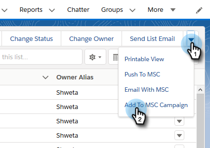
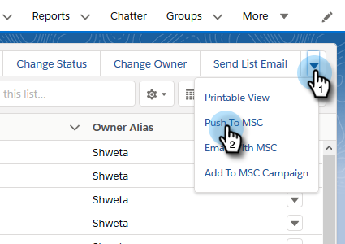

# Verwenden von Massenaktionen in [!DNL Salesforce Lightning] {#using-bulk-actions-in-salesforce-lightning}

Erfahren Sie, wie Sie Massenaktionen durchführen, z. B. Leads zu einer Kampagne hinzufügen, eine Massen-E-Mail senden oder Leads von [!DNL Salesforce] zu [!DNL Sales Connect] pushen.

>[!PREREQUISITES]
>
>Aktualisieren Sie auf die neueste Version des [!DNL Sales Connect]-Pakets und installieren Sie die Massenaktionsschaltflächen in Ihrer Lead-/Kontaktansicht.
>
>* [Anweisungen in englischer Sprache](assets/sf-guide-for-lightning-en.pdf)
>* [Anleitungen auf Japanisch](assets/sf-guide-for-lightning-ja.pdf)

>[!NOTE]
>
>Bevor Sie die folgenden Schritte ausführen, stellen Sie sicher, dass Sie bei Ihrem [!DNL Marketo Sales Connect]-Konto angemeldet sind.

## Bulk Email {#bulk-email}

1. Klicken Sie [!DNL Salesforce] auf die Registerkarte **[!UICONTROL Leads]** und wählen Sie dann die Liste der gewünschten Leads aus.

   

   >[!NOTE]
   >
   >Wenn Sie sich bereits in der Liste befinden, die Sie verwenden werden, müssen Sie sie erneut ausführen, indem Sie sie aus der Dropdown-Liste auswählen, um sicherzustellen, dass die MSC-Massenaktionsschaltflächen angezeigt werden. Dies ist [!DNL Salesforce] Verhalten, das nicht geändert werden kann.

1. Klicken Sie auf den Pfeil der Dropdown-Liste (ganz rechts auf dem Bildschirm) und wählen Sie **[!UICONTROL E-Mail mit MSC]**.

   

1. Eine MSC-E-Mail wird angezeigt. Es umfasst die folgenden Funktionen:

   a. Das Feld [!UICONTROL An] zeigt „Alle Wareneingänge“ an. Dies entspricht der Liste der Leads, die Sie in der Lead-Listenansicht ausgewählt haben
b. Diese Liste ist im linken Bereich namens „Massenverarbeitung“ sichtbar - Sie können hier Empfänger hinzufügen/entfernen
c. Sie können eine Vorlage auswählen oder Ihre eigene E-Mail erstellen
d. Sie können die E-Mail sofort senden oder einen Zeitplan festlegen, um sie zu einem späteren Zeitpunkt zu senden

   

## Zur Kampagne hinzufügen {#add-to-campaign}

1. Klicken Sie [!DNL Salesforce] auf die Registerkarte **[!UICONTROL Leads]** und wählen Sie dann die Liste der gewünschten Leads aus.

   

1. Klicken Sie auf den Pfeil der Dropdown-Liste (ganz rechts im Bildschirm) und wählen Sie **[!UICONTROL Zu MSC-Kampagne hinzufügen]**.

   

1. Ein Popup [!UICONTROL Personen zu Ihrer Kampagne hinzufügen] wird angezeigt. Klicken Sie **[!UICONTROL Weiter]** und gehen Sie durch den typischen Kampagnenfluss, um eine MSC-Kampagne Trigger.

   

## Push an [!DNL Marketo Sales Connect] {#push-to-marketo-sales-connect}

1. Klicken Sie [!DNL Salesforce] auf die Registerkarte **[!UICONTROL Leads]** und wählen Sie dann die Liste der gewünschten Leads aus.

   

1. Klicken Sie auf den Pfeil der Dropdown-Liste (ganz rechts auf dem Bildschirm) und wählen Sie **[!UICONTROL Push to MSC]**.

   

1. Eine neue Registerkarte mit dem Namen &quot;[!DNL Salesforce] Bridge&quot; wird geöffnet. Klicken Sie auf **[!UICONTROL Schaltfläche ]Mit Gruppe fortfahren→**.

   

1. Sie werden an Ihr MSC-Konto gesendet, wo eine Gruppe mit Datum/Zeitstempel erstellt wird. Sie erhalten eine Benachrichtigung, sobald die Synchronisierung abgeschlossen ist und die Gruppe die aus [!DNL Salesforce] synchronisierten Leads enthält.

   

>[!NOTE]
>
>Sie können dieselben Schritte ausführen, um Massenaktionen auch in der Kontaktlistenansicht zu verwenden.

>[!MORELIKETHIS]
>
>* [Senden von E-Mails über Gruppen-E-Mails](/help/marketo/product-docs/marketo-sales-connect/email/using-the-compose-window/sending-emails-via-group-email.md)
>* [Erstellen von Massen-E-Mails mit Auswählen und Senden](/help/marketo/product-docs/marketo-sales-connect/email/using-the-compose-window/composing-bulk-emails-with-select-and-send.md#sending-emails)
