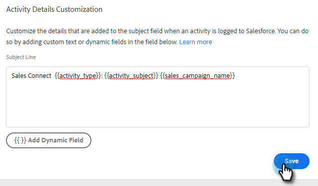

# Konfigurieren [!DNL Salesforce] Anpassung von Aktivitätsdetails {#configure-salesforce-activity-detail-customization}

>[!PREREQUISITES]
>
>* [!DNL Salesforce] und [!DNL Marketo Sales Connect] [müssen verbunden sein](/help/marketo/product-docs/marketo-sales-connect/crm/salesforce-integration/connect-your-sales-connect-account-to-salesforce.md)
>* E-Mail-Aktivität über API protokollieren [muss aktiviert sein](/help/marketo/product-docs/marketo-sales-connect/crm/salesforce-integration/salesforce-sync-settings.md)

Mit der Anpassung von Aktivitätsdetails können Administratoren die Informationen konfigurieren, die beim Synchronisieren einer [!DNL Sales Connect] Aktivität/Erinnerungsaufgabe mit Salesforce beim Salesforce-Aufgabenfeld „Aufgabe - Betreff“ protokolliert werden.

>[!NOTE]
>
>* Aktualisierungen, die im [!DNL Sales Connect] einer Erinnerungsaufgabe am Betrefffeld vorgenommen wurden, werden im Betrefffeld der entsprechenden [!DNL Salesforce] Aufgabe angezeigt, wenn Sie das dynamische Feld `{{activity_subject}}` in Ihrer Anpassung der Aktivitätsdetails verwenden.
>* Zeilenumbrüche werden beim Protokollieren von Informationen im Feld „Betreff [!DNL Salesforce]&quot; nicht unterstützt. Alle Zeilenumbrüche im Editor zur Anpassung von Aktivitätsdetails werden entfernt, wenn ein Betreff für eine Verkaufsaufgabe aktualisiert wird.

<table>
 <tr>
  <td><strong>1</td>
  <td>InMail-Erinnerungsaufgabe</td>
 </tr>
 <tr>
  <td><strong>2</td>
  <td>E-Mail-Aktivität</td>
 </tr>
 <tr>
  <td><strong>3</td>
  <td>Aktivität „Aufruf“</td>
 </tr>
</table>

Mit der Funktion können die folgenden Vorteile erzielt werden:

* Durch die Anpassung der Informationen, die im Betrefffeld angezeigt werden, können Aktivitätsdetails in Salesforce einfach für den Vertrieb durchsucht werden.
* Admins können das Betrefffeld mit einer eindeutigen Kennung wie „moto_sales“ versehen, damit Aktivitäten aus Sales Connect einfach identifiziert und von anderen E-Mail-Aktivitäten, Anrufaktivitäten und Aufgaben unterschieden werden können.
* Reduzieren Sie den Bedarf an benutzerdefinierten Aktivitätsfeldern. Salesforce erzwingt Beschränkungen für die Anzahl der benutzerdefinierten Aktivitätsfelder, wodurch eingeschränkt werden kann, welche Daten in Berichten verwendet werden können. Wenn Sie dynamische Aktivitätsfelder verwenden, um Schlüsseldaten zur Betreffzeile hinzuzufügen, können Sie die Anzahl der benutzerdefinierten Aktivitätsfelder reduzieren, die Sie in Ihrer Salesforce-Instanz erstellen müssen.
* Das Betrefffeld der Aktivitäten und Aufgaben folgt einem konsistenten Muster, das vom Sales Connect-Administrator definiert wird.

>[!NOTE]
>
>Wenn Sie E-Mail-Antworten als Aktivitäten für [!DNL Salesforce] protokollieren, werden die [!DNL Salesforce] Einstellungen zur Anpassung von Aktivitätsdetails nicht verwendet. Stattdessen wird „Antwort: E-Mail-Betreff“ protokolliert.

## Unterstützte dynamische Aktivitätsfelder {#activity-dynamic-fields-supported}

Dynamische Aktivitätsfelder : Referenzinformationen zu Ihren Vertriebsaktivitäten, um Daten zu füllen. Heute können sie mit [!DNL Salesforce] Anpassung von Aktivitätsdetails verwendet werden.

>[!NOTE]
>
>Wenn kein Wert zum Ausfüllen des dynamischen Felds für eine bestimmte Aktivität/Aufgabe vorhanden ist, werden beim Aktualisieren des Felds „Aufgabe [!DNL Salesforce] - Betreff“ keine Daten für dieses dynamische Feld ausgefüllt.

<table>
 <tr>
  <th>Feld</th>
  <th>Beschreibung</th>
 </tr>
 <tr>
  <td>{{activity_type}}</td>
  <td>füllt den Aufgabentyp als E-Mail, Anruf, InMail oder Benutzerdefiniert aus.</td>
 </tr>
 <tr>
  <td>{{activity_subject}}</td>
  <td>
Befüllt den Betreff der Aufgabe.

      
Bei E-Mails wird die Betreffzeile der E-Mail ausgefüllt.

      
Bei einem -Aufruf, inMail oder einem benutzerdefinierten Aufruf wird ein Wert eingetragen, wenn im Feld Aufgabenname/Betreff eine Erinnerungsaufgabe mit einem Wert erstellt wurde.
</td>
 </tr>
 <tr>
  <td>{{sales_campaign_name}}</td>
  <td>Wenn die Aktivität von einer Verkaufskampagne initiiert wurde, wird der Name der Verkaufskampagne angegeben.</td>
 </tr>
 <tr>
  <td>{{sales_campaign_day}}</td>
  <td>Wenn die Aktivität von einer Verkaufskampagne initiiert wurde, wird die Tagesnummer der Verkaufskampagne angegeben, an der diese Aktivität stattgefunden hat.</td>
 </tr>
 <tr>
  <td>{{sales_campaign_step}}</td>
  <td>Wenn die Aktivität von einer Verkaufskampagne initiiert wurde, wird die Schrittnummer innerhalb der Verkaufskampagne am Tag ausgefüllt, an dem diese Aktivität stattgefunden hat.</td>
 </tr>
 <tr>
  <td>{{call_outcome}}</td>
  <td>Wenn es sich bei der Aktivität um einen Aufruf handelt und ein Aufrufergebnis ausgewählt wird, wird der Wert für das Aufrufergebnis ausgefüllt.</td>
 </tr>
 <tr>
  <td>{{call_reason}}</td>
  <td>Wenn es sich bei der Aktivität um einen Aufruf handelt und ein Anrufgrund ausgewählt ist, wird der Wert für den Anrufgrund ausgefüllt.</td>
 </tr>
</table>

## Konfigurieren der Anpassung von Salesforce-Aktivitätsdetails {#configuring-salesforce-activity-detail-customization}

>[!NOTE]
>
>**Administratorberechtigungen erforderlich.**

Berücksichtigen Sie bei der Konfiguration Ihrer Aktivitätsdetails, welche Daten für den Vertrieb am relevantesten sind, wenn Sie den Aufgabenverlauf in [!DNL Salesforce] überprüfen.

1. Klicken Sie auf das Zahnradsymbol und wählen Sie **[!UICONTROL Einstellungen]** aus.

   

1. Auf **[!UICONTROL Salesforce]**.

   

1. Klicken Sie auf **[!UICONTROL Einstellungen synchronisieren]**.

   

1. Fügen Sie im Editor zur Anpassung der Aktivitätsdetails einen beliebigen freien Text hinzu. Hinzugefügter Text ist nicht dynamisch und bleibt für das Betrefffeld aller mit [!DNL Salesforce] synchronisierten Aufgaben unverändert.

   

   >[!TIP]
   >
   >Wenn hinzugefügter Text in gerade Klammern eingeschlossen wird, ist dies zwar nicht erforderlich, doch kann es für manche Personen einfacher sein, zwischen den Daten zu unterscheiden, wenn sie in ein Betrefffeld in Salesforce eingefügt werden. Beispiel: `[Sales Connect] - {{Activity_type}}`

1. Fügen Sie alle gewünschten zusätzlichen dynamischen Felder hinzu, indem Sie auf die Schaltfläche **[!UICONTROL Dynamisches Feld hinzufügen]** klicken.

   

1. Wählen Sie die gewünschten dynamischen Felder aus.

   

1. Klicken Sie auf **[!UICONTROL Speichern]**.

   

>[!NOTE]
>
>[!DNL Salesforce] erzwingt eine Beschränkung auf 255 Zeichen. Wenn Ihre Aktivitätsdetails diesen Wert überschreiten, werden sie abgeschnitten, um sicherzustellen, dass die Informationen im Feld [!DNL Salesforce] Betreff gespeichert werden.

>[!MORELIKETHIS]
>
>* [Einstellungen synchronisieren](/help/marketo/product-docs/marketo-sales-connect/crm/salesforce-integration/salesforce-sync-settings.md)
>* [Erinnerungsaufgabe - Synchronisieren mit [!DNL Salesforce]](/help/marketo/product-docs/marketo-sales-connect/tasks/reminder-task-sync-with-salesforce.md)
>* [[!DNL Sales Connect] Anpassung für CRM](/help/marketo/product-docs/marketo-sales-connect/crm/salesforce-customization/sales-connect-customizations-for-crm.md)
