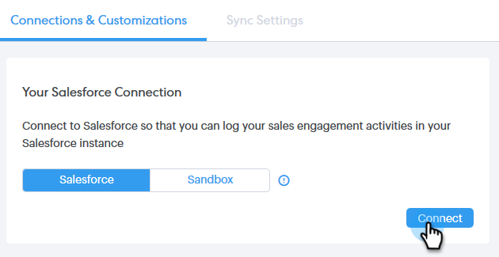

# Verbinden Ihres Sales Connect-Kontos mit Salesforce {#connect-your-sales-connect-account-to-salesforce}

Führen Sie diese einfachen Schritte aus, um [!DNL Sales Connect] mit [!DNL Salesforce] zu verbinden.

## Verbinden von als Admin {#how-to-connect-as-an-admin}

1. Klicken Sie [!DNL Sales Connect] oben rechts auf das Zahnradsymbol und dann auf **[!UICONTROL Einstellungen]**.

   

1. Klicken Sie unter [!UICONTROL  Admin-] auf **[!UICONTROL Salesforce]**.

   

1. Klicken Sie auf [!UICONTROL  Registerkarte ]Verbindungen und Anpassungen“ auf **[!UICONTROL Verbinden]**.

   

1. Klicken Sie auf **[!UICONTROL OK]**.

   

1. Wenn Sie bereits bei Salesforce angemeldet sind, sind Sie angemeldet. Andernfalls werden Sie zum Anmelden aufgefordert.

## Verbinden von als Benutzer ohne Administratorrechte {#how-to-connect-as-a-non-admin}

1. Klicken Sie [!DNL Sales Connect] auf das Zahnradsymbol und wählen Sie **[!UICONTROL Einstellungen]** aus.

   

1. Wählen [!UICONTROL  unter „Mein ]&quot; die Option **[!UICONTROL Salesforce]**.

   

1. Klicken Sie auf [!UICONTROL  Registerkarte ]Verbindungen und Anpassungen“ auf **[!UICONTROL Verbinden]**.

   

1. Klicken Sie auf **[!UICONTROL OK]**.

   

1. Wenn Sie bereits bei Salesforce angemeldet sind, sind Sie angemeldet. Andernfalls werden Sie zum Anmelden aufgefordert.
