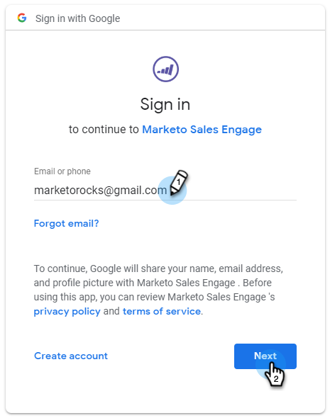

# E-Mail-Verbindung für Gmail-Benutzer {#email-connection-for-gmail-users}

Eine Verbindung zu Gmail bedeutet, dass Sie Antworten verfolgen, Zugriff auf den Gmail Versand Kanal erhalten, E-Mails in Gmail planen und die Einhaltung von Richtlinien senden können.

1. Klicken Sie in Sales Connect auf das Zahnradsymbol und wählen Sie **Einstellungen**.

   

1. Wählen Sie unter Mein Konto **E-Mail-Einstellungen**.

   

1. Klicken Sie auf die Registerkarte **E-Mail-Verbindung**.

   

1. Klicken Sie auf **Erste Schritte**.

   

1. Wählen Sie **Ich verwende Gmail zum Senden von E-Mails** und klicken Sie auf **Weiter**.

   

1. Klicken Sie auf **OK**.

   

1. Wenn Sie sich bereits bei Gmail angemeldet haben, wählen Sie das Konto aus, mit dem Sie eine Verbindung herstellen möchten. Falls nicht, geben Sie Ihre E-Mail-Adresse ein und klicken Sie auf **Weiter**. In diesem Beispiel sind wir noch nicht angemeldet.

   

1. Geben Sie Ihr Kennwort ein und klicken Sie auf **Weiter**.

   

1. Klicken Sie auf **Allow**.

   

   Sie können diese Verbindung verwenden, um E-Mails und auch als Versand-Kanal zu verfolgen.

>[!NOTE]
>
>Gmail setzt seine eigenen Sendeschränkungen um. [Weitere Informationen finden Sie hier](/help/marketo/product-docs/marketo-sales-connect/email/email-delivery/email-connection-throttling.md#email-provider-limits).
