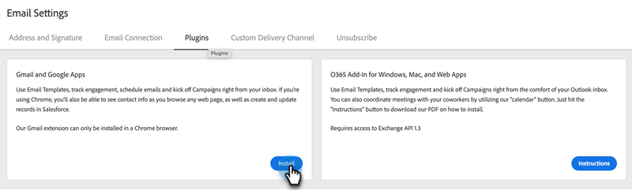

# Installieren des Sales Connect E-Mail-Plug-ins für Gmail {#install-the-sales-connect-email-plugin-for-gmail}

Erfahren Sie, wie Sie das Gmail-Plug-in installieren.

>[!IMPORTANT]
>
>Die E-Mail-Plug-ins für Gmail und Outlook werden nur für Benutzende von Marketo Sales Connect unterstützt. Sie werden **nicht** für Benutzende von Sales Insight Actions unterstützt.

1. Klicken Sie in [Web-](https://toutapp.com/next#settings)) auf das Zahnradsymbol und dann auf **[!UICONTROL Einstellungen]**.

   

1. Klicken Sie unter Mein Konto auf **[!UICONTROL E-Mail-Einstellungen]**.

   

1. Klicken Sie auf **[!UICONTROL Registerkarte]** Plug-ins“.

   

1. Klicken Sie unter Gmail und Google Apps auf **[!UICONTROL Installieren]**.

   
