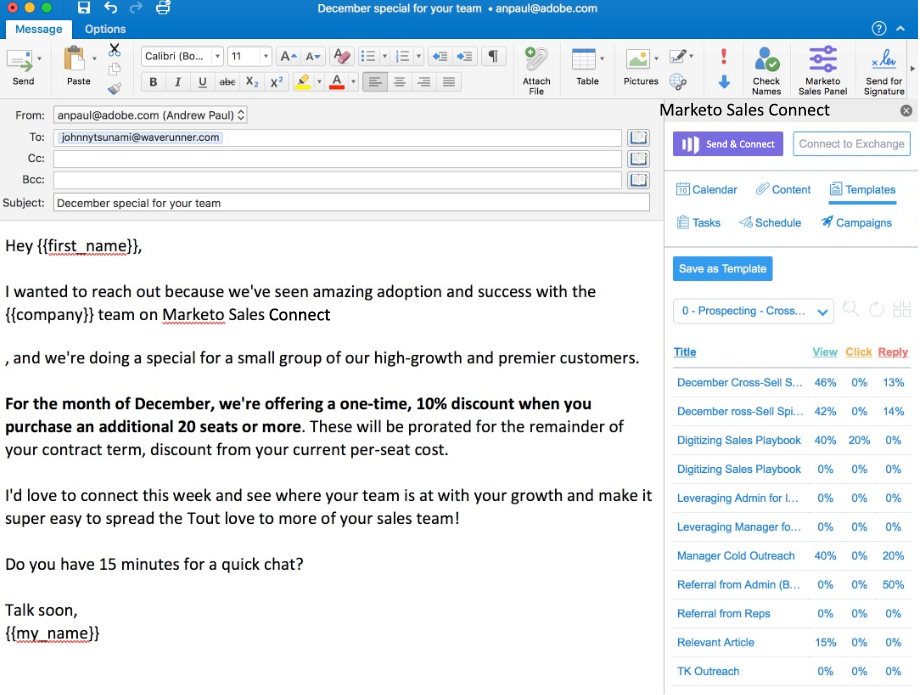

# Installieren des Sales Connect E-Mail-Plug-ins für Outlook (Online, Mac und Windows) {#install-the-sales-connect-email-plugin-for-outlook}

Wir haben eine Integration mit [!DNL Outlook Web Apps] erstellt. [!DNL Outlook Web Apps] ist eine Version von [!DNL Outlook], die mit dem [!DNL Office 365]-Abonnement bereitgestellt wird. Da die Integration browserbasiert ist, funktioniert sie sowohl auf Mac als auch auf [!DNL Windows]. [Klicken Sie hier für die vollständige Installationsanleitung](https://s3.amazonaws.com/tout-user-store/outlook-mac/assets/install_tout_add-in_outlook_mac.pdf).

Als Administrator können Sie [im Namen Ihres gesamten Teams installieren](https://docs.microsoft.com/en-us/office365/admin/manage/manage-deployment-of-add-ins?view=o365-worldwide).

>[!IMPORTANT]
>
>Die E-Mail-Plug-ins für Gmail und Outlook werden nur für Benutzende von Marketo Sales Connect unterstützt. Sie werden **nicht** für Benutzende von Sales Insight Actions unterstützt.

>[!NOTE]
>
>Wenn Sie keine Store-Schaltfläche haben, verwenden Sie nicht die neueste Version von [!DNL Outlook] für Mac. Führen Sie die folgenden Schritte aus, um aktualisiert zu werden:
>
>I. Rufen Sie die Schaltfläche Hilfe auf (in der oberen Navigationsleiste rechts neben „Outlook„).
>
>ii. Wählen Sie **[!UICONTROL Dropdown-Menü]** Nach Updates suchen“ aus
>
>iii. Aktualisieren Sie auf die neueste Version von Outlook, und kehren Sie nach Abschluss des Vorgangs zu diesen Schritten zurück

>[!NOTE]
>
>Das .NET-Add-in unterstützt nicht mehr die Planung von E-Mails aus [!DNL Outlook]. Sie müssen auf das [!DNL Office365]-Add-in aktualisieren, um E-Mails zu planen.
