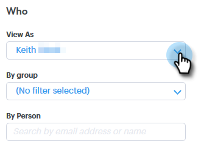

# Erweiterte Suchübersicht {#advanced-search-overview}

Mithilfe der erweiterten Suche können Sie potenzielle Kunden auswählen, die E-Mails angesehen, angeklickt oder beantwortet haben. Auf diese Weise können Sie eine gezielte Liste Ihrer am meisten engagierten Interessenten erstellen.

## Zugriff auf erweiterte Suche {#how-to-access-advanced-search}

1. Klicken **Command Center**.

   

1. Klicken **E-Mails**.

   

1. Wählen Sie die entsprechende Registerkarte aus.

   

1. Klicken **Erweiterte Suche**.

   

## Filter {#filters}

**Datum**

Wählen Sie den Datumsbereich für Ihre Suche aus. Vordefinierte Datumswerte werden entsprechend dem von Ihnen ausgewählten E-Mail-Status aktualisiert (Gesendet, Nicht zugestellt, Ausstehend).

**Wer**

Filtern Sie im Abschnitt Wer nach E-Mail-Empfänger/Absender.

| Dropdown | Beschreibung |
|---|---|
| **Anzeigen als** | Filtern Sie nach einem bestimmten Absender in Ihrer Sales Connect-Instanz (diese Option steht nur Administratoren zur Verfügung). |
| **Nach Gruppe** | Filtern von E-Mails nach einer bestimmten Empfängergruppe |
| **Nach Person** | Filtern nach einem bestimmten Empfänger. |

**Wann**

Wählen Sie das Erstellungsdatum, das Lieferdatum, das Datum für fehlgeschlagen oder das geplante Datum aus. Die verfügbaren Optionen hängen vom gewählten E-Mail-Status ab (Gesendet, Nicht zugestellt, Ausstehend).

**Kampagnen**

Filtern von E-Mails nach Kampagnenbeteiligung.

**Status**

Es gibt drei E-Mail-Status, aus denen Sie wählen können. Der Typ/die Aktivitätsoptionen ändern sich je nach ausgewähltem Status.

***Status: Gesendet***

Filtert nach der Aktivität &quot;Gesendete E-Mail&quot;. Sie können Ansichten/keine Ansichten, Klicks/keine Klicks und/oder Antworten/keine Antworten auswählen.

***Status: Ausstehend***

Filtert nach allen ausstehenden E-Mails.

| Status | Beschreibung |
|---|---|
| **Geplant** | E-Mails, die aus dem Komprimierungsfenster (Salesforce oder die Web-App), E-Mail-Plug-ins oder einer Kampagne geplant wurden. |
| **Entwürfe** | E-Mails, die sich derzeit im Entwurfsstatus befinden. E-Mails benötigen eine Betreffzeile und einen Empfänger, um als Entwurf gespeichert zu werden. |
| **in progress** | E-Mails, die gerade gesendet werden. E-Mails dürfen diesen Status nicht länger als einige Sekunden beibehalten. |

***Status: Nicht bereitgestellt***

Filtert nach E-Mails, die nie zugestellt wurden.

| Status | Beschreibung |
|---|---|
| **fehlgeschlagen** | Wenn der Versand einer E-Mail über Sales Connect fehlschlägt (häufige Ursachen sind: E-Mails werden an abgemeldete/blockierte Kontakte gesendet oder wenn ein Problem beim Ausfüllen der dynamischen Felder aufgetreten ist). |
| **Unzustellbar** | Eine E-Mail wird als nicht zugestellt markiert, wenn sie vom Server des Empfängers abgelehnt wird. Hier werden nur E-Mails angezeigt, die über Sales Connect-Server gesendet wurden. |
| **Spam** | Wenn die E-Mail vom Empfänger als Spam gekennzeichnet wurde (üblicher Begriff für unerwünschte E-Mails). Hier werden nur E-Mails angezeigt, die über Sales Connect-Server gesendet wurden. |

## Gespeicherte Suchen {#saved-searches}

So erstellen Sie eine gespeicherte Suche.

1. Nachdem alle Filter eingerichtet sind, klicken Sie auf **Filter speichern unter**.

   

1. Benennen Sie die Suche und klicken Sie auf **Speichern**.

   

   Ihre gespeicherten Suchen befinden sich in der Seitenleiste auf der linken Seite.

   
