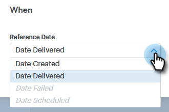
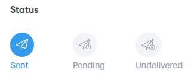

# Erweiterte Suche - Übersicht {#advanced-search-overview}

Mithilfe der erweiterten Suche können Sie eine Liste Ihrer aktivsten potenziellen Kunden erstellen, die E-Mails angesehen, angeklickt oder beantwortet haben.

## Zugriff auf die erweiterte Suche {#how-to-access-advanced-search}

1. Klicken Sie **Command Center**.

   

1. Klicken Sie auf **E-Mails**.

   

1. Wählen Sie die entsprechende Registerkarte aus.

   

1. Klicken Sie **Erweiterte Suche**.

   

## Filter {#filters}

**Datum**

Wählen Sie den Datumsbereich für Ihre Suche. Vordefinierte Datumswerte werden je nach ausgewähltem E-Mail-Status aktualisiert (gesendet, nicht zugestellt, ausstehend).

**Wer**

Filtern Sie im Abschnitt „Wer“ nach E-Mail-Empfänger/-Absender.

| Dropdown | Beschreibung |
|---|---|
| **Anzeigen als** | Filtern Sie nach einem bestimmten Absender in Ihrer Sales Connect-Instanz (diese Option steht nur Administratoren zur Verfügung). |
| **Nach Gruppe** | E-Mails nach einer bestimmten Empfängergruppe filtern |
| **nach Person** | Nach einem bestimmten Empfänger filtern. |

**Wenn**

Wählen Sie „Nach Erstellungsdatum“, „Zustellungsdatum“, „Fehlgeschlagen“ oder „Geplant“ aus. Die verfügbaren Optionen ändern sich je nach ausgewähltem E-Mail-Status (gesendet, nicht zugestellt, ausstehend).

**Kampagnen**

E-Mails nach Kampagnenbeteiligung filtern.

**Status**

Es gibt drei E-Mail-Status zur Auswahl. Die Typ-/Aktivitätsoptionen ändern sich je nach ausgewähltem Status.

***Status: gesendet***

Filtert nach der Aktivität „Gesendete E-Mails“. Sie können Ansichten/keine Ansichten, Klicks/keine Klicks und/oder Antworten/keine Antworten auswählen.

***Status: Ausstehend***

Filtert nach allen ausstehenden E-Mails.

| Status | Beschreibung |
|---|---|
| **Geplant** | E-Mails, die über das Fenster „Erstellen“ (Salesforce oder die Web-App), E-Mail-Plug-ins oder eine Kampagne geplant wurden. |
| **Entwürfe** | E-Mails, die sich derzeit im Entwurfsstatus befinden. E-Mails benötigen eine Betreffzeile und einen Empfänger, damit sie als Entwurf gespeichert werden können. |
| **In Bearbeitung** | E-Mails, die gerade gesendet werden. E-Mails sollten in diesem Zustand nicht länger als einige Sekunden bleiben. |

***Status: Nicht zugestellt***

Filtert nach E-Mails, die nie zugestellt wurden.

| Status | Beschreibung |
|---|---|
| **Fehlgeschlagen** | Wenn eine E-Mail nicht von Sales Connect gesendet werden kann (häufige Gründe sind: E-Mails werden an abgemeldete/blockierte Kontakte gesendet oder es gab ein Problem beim Ausfüllen der dynamischen Felder). |
| **Bounce** | Eine E-Mail wird als Bounce markiert, wenn sie vom Server des Empfängers abgelehnt wird. Hier werden nur E-Mails angezeigt, die über Sales Connect-Server gesendet wurden. |
| **Spam** | Wann die E-Mail vom Empfänger als Spam markiert wurde (allgemeiner Begriff für unerwünschte E-Mails). Hier werden nur E-Mails angezeigt, die über Sales Connect-Server gesendet wurden. |

## Gespeicherte Suchvorgänge {#saved-searches}

So erstellen Sie eine gespeicherte Suche.

1. Nachdem Sie alle Filter eingerichtet haben, klicken Sie auf **Filter speichern unter**.

   

1. Geben Sie der Suche einen Namen und klicken Sie auf **Speichern**.

   

   Ihre gespeicherten Suchvorgänge werden in der Seitenleiste auf der linken Seite angezeigt.

   
