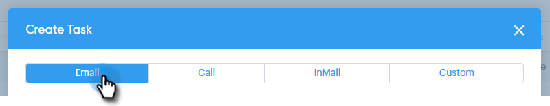

# Zuweisen von Aufgaben zu Teammitgliedern {#assigning-tasks-to-team-members}

Wenn Sie mit anderen Teammitgliedern zusammenarbeiten möchten, ist die Zuweisung von Aufgaben eine gute Möglichkeit, Ihre Prospektivbemühungen zu koordinieren.

>[!NOTE]
>
>Sie können nur Aufgaben für freigegebene Kontakte zuweisen. Bevor Sie mit freigegebenen Aufgaben zusammenarbeiten, sollten Sie [eine Kontaktgruppe für Ihre Teammitglieder freigeben.](/help/marketo/product-docs/marketo-sales-connect/people/managing-contacts/how-to-share-a-group.md)

1. Klicken Sie auf **Command Center**.

   

1. Klicken Sie auf **Hinzufügen Aufgabe**.

   

1. Wählen Sie den Typ der Aufgabe aus.

   

1. Benennen Sie Ihre Aufgabe!

   

1. Wählen Sie im Feld &quot;Aufgabe zuweisen&quot;die Person in Ihrem Team aus, der Sie die Aufgabe zuweisen möchten.

   

1. hinzufügen die Person, zu der Sie im Feld &quot;Person&quot;Kontakt aufnehmen möchten.

   

1. Wählen Sie das Fälligkeitsdatum aus.

   

1. Legen Sie die Priorität fest.

   

1. hinzufügen Sie alle wichtigen Details, die für Ihr Team relevant sind (optional), und klicken Sie auf **Erstellen**.

   

>[!MORELIKETHIS]
>
>[Freigeben einer Gruppe](/help/marketo/product-docs/marketo-sales-connect/people/managing-contacts/how-to-share-a-group.md)
