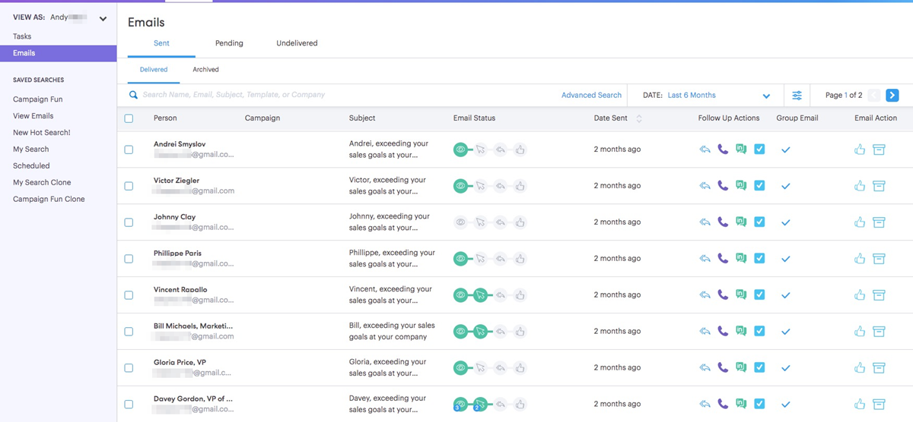
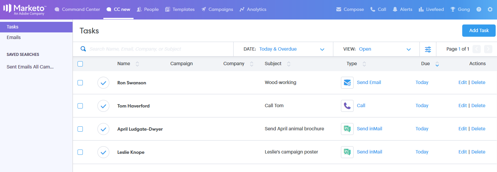

# Übersicht über das Command Center {#command-center-overview}

Das Commend Center ist eine zentrale, einheitliche Ansicht, mit der Sie den nächsten Schritt finden und gleichzeitig sicherstellen können, dass nichts durch die Risse fällt.

## E-Mails verwalten {#manage-emails}

Im E-Mail-Bereich des Command Centers können Sie Ihre gesamte E-Mail-Aktivität verwalten. Stellen Sie sich dies als Ihren E-Mail-Postausgang vor, um E-Mails zu überprüfen, die von Sales Connect gesendet wurden. Verwalten Sie geplante E-Mails, sehen Sie, wer mit Ihren E-Mails interagiert hat, überprüfen Sie, ob Probleme mit dem Versand Ihrer E-Mails aufgetreten sind und vieles mehr.

Im E-Mail-Bereich erhalten Sie einen Überblick über alle E-Mails und können Ihre Organisation mit primären Tabs und Unterregisterkarten vereinfachen, die als Ordner fungieren, in denen Ihre E-Mails automatisch basierend auf ihrem Status gespeichert werden.

<table> 
 <colgroup> 
  <col> 
  <col> 
  <col> 
 </colgroup> 
 <tbody> 
  <tr> 
   <td title="Hintergrundfarbe : Grau">
<strong>Primär </strong>
</td> 
   <td title="Hintergrundfarbe : Grau">
<strong>Sekundär </strong>
</td> 
   <td title="Hintergrundfarbe : Grau">
<strong>Beschreibung </strong>
</td> 
  </tr> 
  <tr> 
   <td title="Hintergrundfarbe : Blau"><strong title="">Gesendet</strong></td> 
   <td title="Hintergrundfarbe : Blau">Zugestellt</td> 
   <td title="Hintergrundfarbe : Blau">An den Empfänger gesendete E-Mails.</td> 
  </tr> 
  <tr> 
   <td title="Hintergrundfarbe : Blau"> </td> 
   <td title="Hintergrundfarbe : Blau">Archiviert</td> 
   <td title="Hintergrundfarbe : Blau">Vom Benutzer archivierte E-Mails, um das Tracking der E-Mails zu deaktivieren.</td> 
  </tr> 
  <tr> 
   <td title="Hintergrundfarbe : Grau"><strong title="">Ausstehend</strong></td> 
   <td title="Hintergrundfarbe : Grau">Geplant</td> 
   <td title="Hintergrundfarbe : Grau">E-Mails, die derzeit für den Versand geplant sind. Nachdem eine E-Mail gesendet wurde, wird sie in den Ordner "Bereitgestellt"verschoben.</td> 
  </tr> 
  <tr> 
   <td title="Hintergrundfarbe : Grau"> </td> 
   <td title="Hintergrundfarbe : Grau">Entwurf</td> 
   <td title="Hintergrundfarbe : Grau">
Als Entwurf gespeicherte E-Mails <strong>Hinweis:</strong> Nur einzelne E-Mails können als Entwürfe gespeichert werden. Massen-E-Mails (E-Mails auswählen und senden und Gruppen-E-Mails) werden nicht als Entwürfe gespeichert.
</td> 
  </tr> 
  <tr> 
   <td title="Hintergrundfarbe : Grau"> </td> 
   <td title="Hintergrundfarbe : Grau">Im Gange</td> 
   <td title="Hintergrundfarbe : Grau">Dies ist ein Zwischenstatus, in den E-Mails gesendet werden, wenn sie sich in der Versandaktion befinden. E-Mails dürfen nur für einen Moment in Bearbeitung sein.</td> 
  </tr> 
  <tr> 
   <td title="Hintergrundfarbe : Blau"><strong title="">Nicht übermittelt</strong></td> 
   <td title="Hintergrundfarbe : Blau">Fehlgeschlagen</td> 
   <td title="Hintergrundfarbe : Blau">E-Mails, die nicht zugestellt werden konnten.</td> 
  </tr> 
  <tr> 
   <td title="Hintergrundfarbe : Blau"> </td> 
   <td title="Hintergrundfarbe : Blau">Hardbounce aufgetreten</td> 
   <td title="Hintergrundfarbe : Blau">
Vom E-Mail-Server der Empfänger zurückgewiesene E-Mails.  <strong>Hinweis:</strong> Dies wird nur erkannt, wenn Sie ein veralteter ToutApp-Benutzer sind und Zugriff auf MSC-Server als Bereitstellungskanal haben.
</td> 
  </tr> 
  <tr> 
   <td title="Hintergrundfarbe : Blau"> </td> 
   <td title="Hintergrundfarbe : Blau">Spam</td> 
   <td title="Hintergrundfarbe : Blau">
E-Mails, die vom Empfänger manuell als Spam gekennzeichnet wurden <strong>Hinweis:</strong> Dies wird nur erkannt, wenn Sie ein veralteter ToutApp-Benutzer sind und Zugriff auf MSC-Server als Bereitstellungskanal haben.
</td> 
  </tr> 
 </tbody> 
</table>

## Aufgaben verwalten {#manage-tasks}

Der Aufgabenbereich ist Ihre zentrale Anlaufstelle für die Verwaltung und Ausführung von Aufgaben. Hier können Sie Ihre Aufgaben nahtlos verwalten, um Ihre Produktivität zu steigern und sich auf die relevantesten Elemente zu konzentrieren.

## Folgemaßnahmen zu den Engagierten Perspektiven {#follow-up-with-engaged-prospects}

Sobald Sie über das Komprimierungsfenster oder die Kampagnen mit Ihren Interessenten in Kontakt getreten sind, können Sie die engagiertesten Interessenten mithilfe der erweiterten Suchfunktion erneut ansprechen.

Wenn Sie beispielsweise 100 Personen zu einer Kampagne in MSC hinzufügen, möchten Sie möglicherweise die Personen, die Ihre E-Mail angesehen und angeklickt haben, aber nicht darauf geantwortet haben, erneut ansprechen. Dazu können Sie den Kampagnenfilter sowie die Filter Status-Aktivität anzeigen und klicken verwenden, um eine Liste der Personen zu identifizieren, die erneut als Ziel ausgewählt werden sollen.

Bonus: Wenn Sie Ihre erweiterte Suche speichern, funktioniert diese als dynamische Liste und fügt E-Mails hinzu, die die Interaktionskriterien erfüllen, sobald der Empfänger Ihre E-Mail anzeigt oder klickt.

>[!MORELIKETHIS]
>
>* [Aufgaben](/help/marketo/product-docs/marketo-sales-connect/tasks/syncing-sales-connect-tasks-with-salesforce-for-the-first-time.md)
>* [Erweiterte Suchübersicht](/help/marketo/product-docs/marketo-sales-connect/email/command-center/advanced-search-overview.md)
>* [Erstellen von Massen-E-Mails mit Auswählen und Senden](/help/marketo/product-docs/marketo-sales-connect/email/using-the-compose-window/composing-bulk-emails-with-select-and-send.md)
