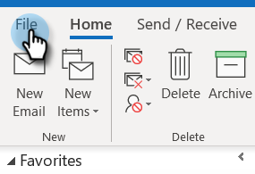

# Verhindern von Selbstansichten {#preventing-self-views}

## Überblick {#overview}

Falsch-Positiv-Meldungen beim Ansichts-Tracking können zu Inkonsistenzen bei der Berichterstellung führen. Dies tritt häufig auf, wenn Benutzer von MSC versehentlich das Tracking-Pixel von ihrem E-Mail-Client aus aufrufen (wir nennen dies eine Selbstansicht). Im Folgenden finden Sie einige Tipps, wie Sie Selbstansichten deutlich reduzieren und sogar beseitigen können.

## Web ([!DNL Outlook Web App] und Gmail) {#web-outlook-web-app-and-gmail}

[!DNL Sales Connect] wird ein Cookie in Ihrem Browser gespeichert, um zu verhindern, dass Ansichten beim Öffnen Ihrer E-Mails aus Outlook Web App und Gmail verfolgt werden. Wenn Sie immer noch Selbstansichten erhalten, empfehlen wir Folgendes:

* Stellen Sie sicher, dass Cookies auf Ihrem Computer aktiviert sind.

* Wenn Sie einen neuen Computer oder ein neues Mobilgerät verwenden, stellen Sie sicher, dass Sie sich bei der Web-Anwendung angemeldet haben. Auf diese Weise können wir Ihren Computer/Ihr Gerät in Zukunft erkennen.

## Desktop (Windows) {#desktop-windows}

Ansichten werden nachverfolgt, indem ein kleines unsichtbares Bildpixel in Ihren E-Mail-Client heruntergeladen wird. Sie können die Anzahl der Selbstansichten in [!DNL Outlook] erheblich verringern, indem Sie deaktivieren, dass Bilder automatisch heruntergeladen werden. Im Folgenden finden Sie nun die Schritte.

1. Klicken Sie [!DNL Outlook] in **[!UICONTROL Menüleiste auf]** Datei“.

   

1. Klicken Sie auf **[!UICONTROL Optionen]**.

   

1. Klicken Sie im Dialogfeld [!DNL Outlook] auf **[!UICONTROL Vertrauensstellungscenter]**.

   

1. Klicken Sie unter [!UICONTROL Microsoft Outlook Trust Center] auf **[!UICONTROL Trust Center-Einstellungen]**.

   

1. Klicken Sie [!UICONTROL  Menü links auf ]Automatischer Download“ und aktivieren Sie das Kontrollkästchen **[!UICONTROL Bilder nicht automatisch in E-Mail- oder RSS-]** von HTML herunterladen.

   

1. Klicken Sie **[!UICONTROL Dialogfeld]** Trust Center[!UICONTROL  auf ]OK“.

   

1. Klicken **[!UICONTROL im Dialogfeld &quot;]** Optionen[!DNL Outlook] auf OK.

   

## Desktop (Mac) {#desktop-mac}

Ansichten werden nachverfolgt, indem ein kleines unsichtbares Bildpixel in Ihren E-Mail-Client heruntergeladen wird. Sie können die Anzahl der Selbstansichten in [!DNL Outlook] erheblich verringern, indem Sie deaktivieren, dass Bilder automatisch heruntergeladen werden. Im Folgenden finden Sie nun die Schritte.

1. Klicken Sie [!DNL Outlook] in der Menüleiste auf **[!UICONTROL Outlook]** und wählen Sie **[!UICONTROL Voreinstellungen]** aus.

   

1. Wählen [!UICONTROL  unter „E]Mail“ die Option **[!UICONTROL Lesen]**.

   

1. Klicken [!UICONTROL  unter ] auf das Optionsfeld **[!UICONTROL Nie]**.

   
