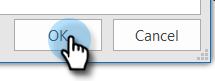

# Vermeiden von Selbstansichten {#preventing-self-views}

## Überblick {#overview}

Falsch-Positiv-Werte für das Ansichtstracking können zu Inkonsistenzen bei der Berichterstellung führen. Dies tritt oft auf, wenn Benutzer von MSC versehentlich das Tracking-Pixel von ihrem E-Mail-Client aus aufrufen (dies wird als Selbstansicht bezeichnet). Im Folgenden finden Sie einige Tipps, wie Sie Selbstansichten deutlich reduzieren und sogar beseitigen können.

## Web (Outlook Web App und Gmail) {#web-outlook-web-app-and-gmail}

Sales Connect speichert ein Cookie in Ihrem Browser, um zu verhindern, dass Ansichten beim Öffnen Ihrer E-Mails in Outlook Web App und Gmail verfolgt werden. Wenn Sie weiterhin Selbstansichten erhalten, empfehlen wir Folgendes:

* Stellen Sie sicher, dass Cookies auf Ihrem Computer aktiviert sind.

* Wenn Sie einen neuen Computer oder ein neues Mobilgerät verwenden, stellen Sie sicher, dass Sie sich bei der Webanwendung angemeldet haben. Dadurch können wir Ihren Computer/Ihr Gerät in Zukunft erkennen.

## Desktop (Windows) {#desktop-windows}

Ansichten werden verfolgt, indem Sie ein kleines unsichtbares Bildpixel in Ihren E-Mail-Client herunterladen. Sie können die Anzahl der Selbstansichten in Outlook erheblich verringern, indem Sie Bilder deaktivieren, die automatisch heruntergeladen werden. Im Folgenden werden die Schritte beschrieben.

1. Klicken Sie in Outlook in der Menüleiste auf **Datei** .

   

1. Klicken Sie auf **Optionen**.

   

1. Klicken Sie im Dialogfeld &quot;Outlook Options&quot;auf **Trust Center**.

   

1. Klicken Sie unter &quot;Microsoft Outlook Trust Center&quot;auf **Einstellungen für das Sicherheitscenter**.

   

1. Klicken Sie links im Menü auf &quot;Automatisch herunterladen&quot;und aktivieren Sie das Kontrollkästchen **Nicht automatisch Bilder in HTML-E-Mail oder RSS-Elemente herunterladen** .

   

1. Klicken Sie im Dialogfeld &quot;Trust Center&quot;auf **OK**.

   

1. Klicken Sie im Dialogfeld &quot;Outlook Options&quot;auf **OK**.

   

## Desktop (Mac) {#desktop-mac}

Ansichten werden verfolgt, indem Sie ein kleines unsichtbares Bildpixel in Ihren E-Mail-Client herunterladen. Sie können die Anzahl der Selbstansichten in Outlook erheblich verringern, indem Sie Bilder deaktivieren, die automatisch heruntergeladen werden. Im Folgenden werden die Schritte beschrieben.

1. Klicken Sie in Outlook in der Menüleiste auf **Outlook** und wählen Sie **Voreinstellungen** aus.

   

1. Wählen Sie unter &quot;E-Mail&quot;die Option **Lesen**.

   

1. Klicken Sie unter &quot;Sicherheit&quot;auf das Optionsfeld **Nie** .

   
