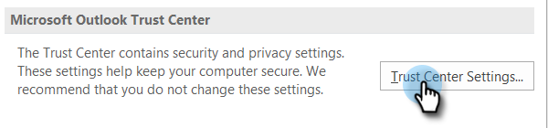

# Vermeidung von Ansichten {#preventing-self-views}

## Übersicht {#overview}

Das Abrufen von Falsch-Positiv-Werten bei der Verfolgung Ihrer Ansicht kann zu Inkonsistenzen bei Berichten führen. Dies tritt oft auf, wenn MSC-Nutzer versehentlich das Verfolgungs-Pixel von ihrem E-Mail-Client aufrufen (wir nennen dies eine Ansicht). Nachstehend finden Sie einige Tipps zur deutlichen Reduzierung und sogar Beseitigung von Ansichten.

## Web (Outlook Web App und Gmail) {#web-outlook-web-app-and-gmail}

Sales Connect speichert ein Cookie in Ihrem Browser, um zu verhindern, dass Ansichten verfolgt werden, wenn Sie Ihre E-Mails aus der Outlook-Webanwendung und Gmail öffnen. Wenn Sie weiterhin selbst Ansichten erhalten, empfehlen wir Folgendes:

* Stellen Sie sicher, dass auf Ihrem Computer Cookies aktiviert sind.

* Wenn Sie einen neuen Computer oder ein neues Mobilgerät verwenden, stellen Sie sicher, dass Sie sich bei der Webanwendung angemeldet haben. Dadurch können wir Ihren Computer/Ihr Gerät in Zukunft erkennen.

## Desktop (Windows) {#desktop-windows}

Ansichten werden verfolgt, indem ein kleines unsichtbares Bildpixel in Ihren E-Mail-Client heruntergeladen wird. Sie können die Anzahl der selbstständigen Ansichten in Outlook erheblich verringern, indem Sie Bilder deaktivieren, die automatisch heruntergeladen werden sollen. Im Folgenden finden Sie die Schritte, wie.

1. Klicken Sie in Outlook in der Menüleiste auf **Datei** .

   

1. Klicken Sie auf **Optionen**.

   

1. Klicken Sie im Dialogfeld &quot;Outlook-Optionen&quot;auf **Vertrauenscenter**.

   

1. Klicken Sie unter &quot;Microsoft Outlook Trust Center&quot;auf **Einstellungen** des Sicherheitszentrums.

   

1. Klicken Sie im Menü links auf &quot;Automatischer Download&quot;und aktivieren Sie das Kontrollkästchen &quot;Bilder **nicht automatisch in HTML-E-Mail oder RSS-Elemente** herunterladen&quot;.

   

1. Klicken Sie im Dialogfeld &quot;Sicherheitscenter&quot;auf **OK** .

   

1. Klicken Sie im Dialogfeld &quot;Outlook-Optionen&quot;auf **OK** .

   

## Desktop (Mac) {#desktop-mac}

Ansichten werden verfolgt, indem ein kleines unsichtbares Bildpixel in Ihren E-Mail-Client heruntergeladen wird. Sie können die Anzahl der selbstständigen Ansichten in Outlook erheblich verringern, indem Sie Bilder deaktivieren, die automatisch heruntergeladen werden sollen. Im Folgenden finden Sie die Schritte, wie.

1. Klicken Sie in Outlook in der Menüleiste auf **Outlook** und wählen Sie **Voreinstellungen**.

   

1. Wählen Sie unter &quot;E-Mail&quot;die Option **Lesen**.

   

1. Klicken Sie unter &quot;Sicherheit&quot;auf das Optionsfeld **Nie** .

   

