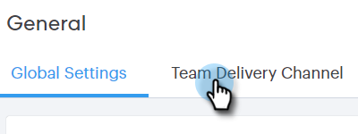

# Einrichten eines benutzerdefinierten Versandkanals {#setting-up-a-custom-delivery-channel}

Marketo Sales Connect ermöglicht Ihnen die Integration mit einem benutzerdefinierten SMTP-Server für den Versand Ihrer E-Mails. Dies ist eine großartige Option für diejenigen, die keine Massen-E-Mails aus ihrem Gmail- oder Exchange-Versandkanal senden möchten.

Benutzer können einen benutzerdefinierten SMTP-Server für ihre eigene Verwendung einrichten, oder Administratoren können ein SMTP-Team einrichten, das für alle Sales Connect-Benutzer in Ihrer Instanz freigegeben wird.

>[!NOTE]
>
>* Zusätzlich zur Einrichtung Ihres SMTP-Servers muss Ihre [E-Mail-Identität überprüft werden](/help/marketo/product-docs/marketo-sales-connect/getting-started/email-settings/verify-your-email.md) bevor Sie E-Mails versenden können.
>* Es wird empfohlen, mit Ihrem IT-Team oder SMTP-Server-Anbieter zusammenzuarbeiten, um die richtigen Server-Anmeldeinformationen für Ihren SMTP-Server zu erhalten.
>* Sie können Ihre Gmail- und Exchange-Server-Anmeldeinformationen nicht über den SMTP-Server verbinden. Nutzen Sie unseren E-Mail-Verbindungsservice, um sich mit diesen Anbietern zu integrieren.

## Benutzerdefiniertes SMTP {#custom-smtp}

1. Melden Sie sich bei der [Web-Anwendung](https://toutapp.com/login) an, klicken Sie oben rechts auf das Zahnradsymbol und wählen Sie **Einstellungen** aus.

   

1. Klicken Sie unter Mein Konto auf **E-Mail-Einstellungen**.

   

1. Klicken Sie **Benutzerdefinierter Versandkanal**.

   

1. Geben Sie Ihre SMTP-Server-Anmeldeinformationen ein und klicken Sie auf **Verbinden**.

   

   >[!NOTE]
   >
   >Wenn dies Ihr einziger Versandkanal ist, wird er automatisch allen Ihren E-Mail-Identitäten zugewiesen und Sie sind hier fertig. Wenn dies nicht der einzige Versandkanal ist, fahren Sie mit Schritt 5 fort.

1. Klicken Sie noch in den E-Mail-Einstellungen auf **Adresse und Signatur**.

   

1. Suchen Sie die E-Mail-Identität, für die Sie einen Versandkanal auswählen möchten, und klicken Sie auf **Versandkanal auswählen**.

   

1. Klicken Sie auf der Zustellbarkeitskarte auf **Bearbeiten**.

   

1. Klicken Sie auf die Dropdown-Liste Kanal und wählen Sie den soeben hinzugefügten benutzerdefinierten Versandkanal aus. Klicken Sie auf **Speichern**.

   

   >[!NOTE]
   >
   >Wenn Ihr Teamadministrator den SMTP-Server für das Team einrichtet, wird er automatisch nur auf Ihre Standard-E-Mail-Identität angewendet und steht als Option für Ihre anderen E-Mail-Identitäten zur Verfügung.

## Team SMTP-Server {#team-smtp-server}

>[!NOTE]
>
>**Administratorberechtigungen erforderlich**

1. Melden Sie sich bei der [Web-Anwendung](https://toutapp.com/login) an, klicken Sie oben rechts auf das Zahnradsymbol und wählen Sie **Einstellungen** aus.

   

1. Klicken Sie unter „Admin Settings“ auf **General**.

   

1. Klicken Sie **Versandkanal des Teams**.

   

1. Geben Sie Ihre SMTP-Server-Anmeldeinformationen ein und klicken Sie auf **Verbinden**.

   

   >[!NOTE]
   >
   >Der SMTP-Server des Teams ist der Standard-Versandkanal der Standard-E-Mail-Identität für alle Team-Mitglieder. Darüber hinaus ist sie als Versandkanal-Option für alle anderen E-Mail-Identitäten verfügbar.

   >[!MORELIKETHIS]
   >
   >* [E-Mail-Verbindung für Gmail-Benutzer](/help/marketo/product-docs/marketo-sales-connect/email-plugins/gmail/email-connection-for-gmail-users.md)
   >
   >* [E-Mail-Verbindung für Outlook-Benutzer](/help/marketo/product-docs/marketo-sales-connect/email-plugins/msc-for-outlook/email-connection-for-outlook-users.md)
