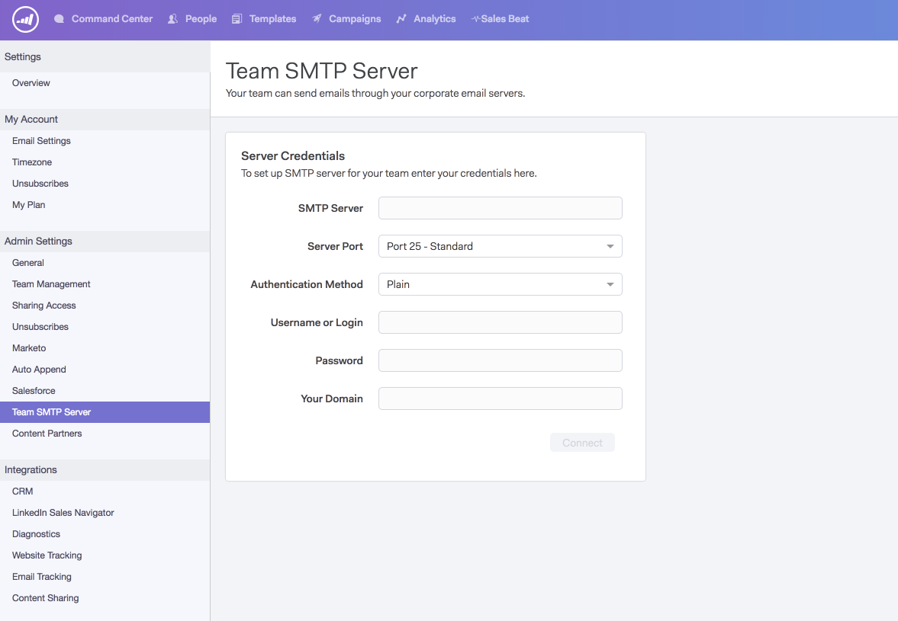

# Einrichten eines SMTP-Servers {#setting-up-an-smtp-server}

## Übersicht {#overview}

**Was ist ein SMTP-Server?**

**Das** Simple  **** Mail  **** Transfer  **** Protocol ist der Server, der für den Versand Ihrer ausgehenden E-Mail verantwortlich ist. Wenn Sie eine E-Mail von Ihrem E-Mail-Client senden, verwenden Sie denselben Dienst, um Ihre E-Mail zu senden.

**Warum möchte ich meinen SMTP-Server mit Sales Connect einrichten?**

Sie ermöglicht es Ihnen, den Ruf Ihrer Firma zu nutzen und sich nicht auf andere zu verlassen. Unsere Standard-MSC-Server sind Teil eines gemeinsamen IP-Pools, was bedeutet, dass sie von einem gemeinsamen Ruf gesendet werden. Wir empfehlen Ihnen, dass Ihr Team einen eigenen Versand-Kanal mit Sales Connect einrichtet.

**Wie sendet Sales Connect mit meinem SMTP-Server?**

Indem Sie [diese Schritte](https://docs.marketo.com/x/ZgPh) befolgen.

`<pre><em>SMTP Server Setup Page in Sales Connect</em>  </pre>` **Muss ich etwas in meinem E-Mail-Client einrichten?**

Was den Kanal eines Versands betrifft, nein. Sobald Sie unser Add-In installiert haben, nutzt Sales Connect denselben Versand-Kanal, den Sie für das Senden von E-Mails eingerichtet haben.

## SMTP-Berechtigungen abrufen {#getting-the-smtp-credentials}

**Wie erhalte ich meine SMTP-Anmeldeinformationen?**

Wenden Sie sich an Ihr IT-Team, um herauszufinden, welchen Versand-Kanal Ihre Firma zum Senden von E-Mails verwendet und wie Sie Zugriff auf Ihre SMTP-Anmeldeinformationen erhalten. Je nachdem, wie Ihr Server konfiguriert ist, verfügen Sie möglicherweise über einige benutzerdefinierte Werte für den SMTP-Servernamen oder den Serveranschluss. Wenn Sie über kein eigenes IT-Team verfügen, wenden Sie sich an Ihren E-Mail-Anbieter.

**Welche Optionen stehen zur Verfügung, wenn meine Firma Office365 verwendet?**

Vorteile

* Einfache Einrichtung
* Jeder Benutzer mit einem Office365-Konto hat Zugriff auf diesen SMTP-Server

Nachteile

* Einschränkungen können auftreten
* Jeder Benutzer muss dies selbst einrichten
* Das Ändern des O365-Kennworts eines Benutzers führt zu einer fehlerhaften Verbindung.

Wenn Sie Office365 oder Exchange Online verwenden, können Sie eine Verbindung zu Ihrem SMTP-Server herstellen, indem Sie einen Standardberechtigungssatz verwenden. Denken Sie daran, dass Office365 kein Massen-E-Mail-Versand-Service ist, auch wenn dies für das Senden von einmaligen E-Mails gut funktioniert. Beim Senden von Massen-E-Mails kann Office365 Ihre E-Mails drosseln, was zu einem fehlgeschlagenen Versand führen kann. Weitere Informationen zu diesem Thema finden Sie im Microsoft-Artikel [wie Sie die SMTP-Clientübermittlung einrichten](https://support.office.com/en-us/article/how-to-set-up-a-multifunction-device-or-application-to-send-email-using-office-365-69f58e99-c550-4274-ad18-c805d654b4c4).

&quot;Sie können nur von einer E-Mail-Adresse aus senden, wenn Ihr Gerät Anmeldeinformationen für mehrere Office 365-Postfächer speichern kann. Office 365 sieht eine Beschränkung von 30 Nachrichten pro Minute und eine Beschränkung von 10.000 Empfängern pro Tag vor.&quot;

Wenn Sie sich entscheiden, Office365 als Versand-Kanal zu verwenden, müssen Sie diese Anmeldeinformationen eingeben. Die gleichen Anmeldeinformationen können nicht für das gesamte Team verwendet werden, da Office365 die E-Mail-Adresse und das Kennwort des Benutzers verwendet, um eine Verbindung herzustellen.

Microsoft- und Bulk-Senden

[Klicken Sie ](https://technet.microsoft.com/en-us/library/exchange-online-limits.aspx#RecipientLimits) hier, um mehr über die Massenversand in Office365 zu erfahren.

Exchange Online-Kunden, die legale Massen-E-Mails für kommerzielle Zwecke versenden müssen (z. B. Newsletter von Kunden), sollten Drittanbieter verwenden, die sich auf diese Dienste spezialisieren.&quot;

**Was ist, wenn meine Firma Gmail benutzt?**

Sie benötigen keine SMTP-Anmeldeinformationen, wenn Ihr Team Gmail als Versand-Kanal mit Sales Connect verwenden möchte. Mit Sales Connect können Benutzer über unsere OAuth-Integration auf ihren Gmail Versand Kanal zugreifen. Benutzer können dies aktivieren, indem sie ihr Sales Connect-Konto mit Gmail integrieren.

**Kann ich die gleichen SMTP-Anmeldeinformationen für mein gesamtes Team freigeben?**

Das hängt vom verwendeten Versand-Kanal ab. Dienste wie Sparkpost erlauben beispielsweise, dass die Anmeldeinformationen domänenbasiert sind, sodass jeder, der mit einer bestimmten Domäne sendet, authentifiziert ist, über diesen Server zu senden. In diesem Fall können Sie die Anmeldeinformationen für das Team freigeben.

Wenn Sie eine Verbindung zu Office365 herstellen, basieren die Anmeldeinformationen auf E-Mail-Adressen. Das bedeutet, dass nur die E-Mail-Adresse, die die Verbindung hergestellt hat, authentifiziert wird, um E-Mails über diesen Versand-Kanal zu senden. Daher sollten die Anmeldeinformationen **nicht** freigegeben werden.

