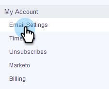

# Einrichten Ihres Versand-Kanals {#setting-up-your-delivery-channel}

Wenn Sie mit Marketo Sales Connect Beginn verwenden, müssen Sie einen SMTP-Server einrichten, um E-Mails zu senden.

>[!NOTE]
>
>Neben der Einrichtung Ihres SMTP-Servers muss Ihre [E-Mail-Identität überprüft werden, bevor Sie E-Mails senden können.](http://docs.marketo.com/x/ewPh)

Sie können E-Mails mit einem benutzerdefinierten SMTP-Server, einem Team-SMTP-Server oder Gmail als Versand-Kanal senden. Gehen wir über jede Option!

## Benutzerspezifisches SMTP {#custom-smtp}

1. Melden Sie sich bei der [Webanwendung](http://toutapp.com/login) an, klicken Sie auf das Zahnradsymbol oben rechts und wählen Sie **Einstellungen**.

   

1. Klicken Sie unter Mein Konto auf **E-Mail-Einstellungen**.

   

1. Wählen Sie **SMTP Server**.

   

1. Geben Sie Ihre SMTP Server-Anmeldeinformationen ein und klicken Sie auf **Connect**.

   

   >[!NOTE]
   >
   >Wenn dies Ihr einziger Versand-Kanal ist, wird er automatisch all Ihren E-Mail-Identitäten zugewiesen und Sie sind hier fertig. Wenn dies nicht Ihr einziger Versand-Kanal ist, fahren Sie mit Schritt 5 fort.

1. Klicken Sie in den E-Mail-Einstellungen weiterhin auf **Adresse und Unterschrift**.

   

1. Suchen Sie die E-Mail-Identität, für die Sie einen Versand-Kanal auswählen möchten, und klicken Sie auf **Wählen Sie den Kanal Versand**.

   

1. Klicken Sie in der Auslieferungskarte auf **Bearbeiten**.

   

1. Klicken Sie auf die Dropdownliste Kanal und wählen Sie den soeben hinzugefügten benutzerspezifischen Versand-Kanal aus. Klicken Sie auf **Speichern**.

   

   >[!NOTE]
   >
   >Wenn Ihr Team-Administrator den Team SMTP Server eingerichtet hat, wird dieser automatisch nur auf Ihre Standard-E-Mail-Identität angewendet und als Option für Ihre anderen E-Mail-Identitäten verfügbar sein.

   **Video ansehen**`<iframe width="630" height="470" src="//play.vidyard.com/YWKSgZvBEjUU8FrXZ5hdYR.html?v=3.1.1" frameborder="0" allowfullscreen></iframe>`

## Team SMTP Server {#team-smtp-server}

>[!NOTE]
>
>**Administratorberechtigungen erforderlich**

1. Melden Sie sich bei der [Webanwendung](http://toutapp.com/login) an, klicken Sie auf das Zahnradsymbol oben rechts und wählen Sie **Einstellungen**.

   

1. Klicken Sie unter &quot;Admin-Einstellungen&quot;auf **Team SMTP Server**.

   

1. Geben Sie Ihre SMTP Server-Anmeldeinformationen ein und klicken Sie auf **Connect**.

   

   >[!NOTE]
   >
   >Der Team SMTP Server ist der Standard-Versand der Standard-E-Mail-Identität aller Teammitglieder. Darüber hinaus ist sie als Versand-Kanal für alle anderen E-Mail-Identitäten verfügbar.

   ** Video abspielen**`<iframe width="630" height="470" src="//play.vidyard.com/Ky9EwGmLcgvsMpFq3H8Y6n.html?v=3.1.1" frameborder="0" allowfullscreen></iframe>`

## Gmail {#gmail}

1. Melden Sie sich bei der [Webanwendung](http://toutapp.com/login) an, klicken Sie auf das Zahnradsymbol oben rechts und wählen Sie **Einstellungen**.

   

1. Klicken Sie unter Mein Konto auf **E-Mail-Einstellungen**.

   

1. Klicken Sie auf **E-Mail-Synchronisierung**.

   

1. Klicken Sie auf **Verbindung zu Google** herstellen.

   

1. Melden Sie sich mit Ihren Google-Anmeldedaten an.
1. Klicken Sie auf **Allow**, wenn Sie diesen Bildschirm aufrufen.

   

   >[!NOTE]
   >
   >Wenn dies Ihr einziger Versand-Kanal ist, wird er automatisch all Ihren E-Mail-Identitäten zugewiesen und Sie sind hier fertig. Wenn Gmail nicht Ihr einziger Versand-Kanal ist, fahren Sie mit Schritt 7 fort.

1. Klicken Sie auf **Adresse und Unterschrift**.

   

1. Klicken Sie auf die E-Mail-Identität, für die Gmail der Kanal des Versands sein soll.

   

1. Wenn das Folienbedienfeld geöffnet wird, blättern Sie nach unten zur Bereitstellungskarte.

   

1. Klicken Sie auf das Dropdown-Menü Kanal und wählen Sie den soeben hinzugefügten Kanal Gmail Versand. Klicken Sie auf **Speichern**.

   

   >[!NOTE]
   >
   >Wenn Ihr Team-Administrator den Team SMTP Server eingerichtet hat, wird dieser automatisch nur auf Ihre Standard-E-Mail-Identität angewendet und als Option für Ihre anderen E-Mail-Identitäten verfügbar sein.

