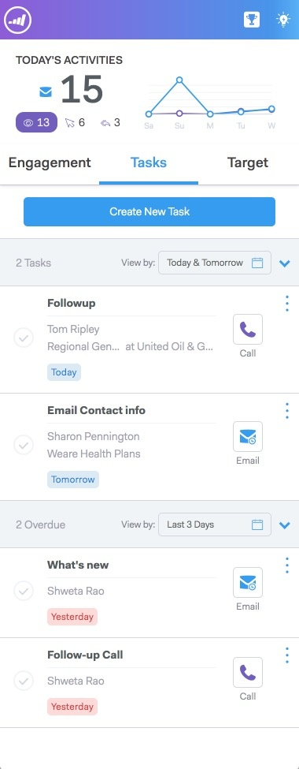

# Live-Feed - Übersicht {#live-feed-overview}

Der Live-Feed ist ein unverankertes Fenster, das über die Web-Anwendung oder das Gmail-Plug-in gestartet werden kann und einen Echtzeitblick auf die Interaktion potenzieller Kundinnen und Kunden bietet.

## Registerkarte „Interaktion“ {#engagement-tab}

Interaktion (Ansichten, Klicks und Antworten) mit Ihren E-Mail-Nachrichten in Echtzeit anzeigen.

Mit Lila gekennzeichnete Personen interagieren mit Ihren Marketing-Inhalten. Diese Menschen existieren möglicherweise nicht bei MSE. Sie können auf den Abwärtspfeil klicken, um sie hinzuzufügen, und eine Liste anderer Schnellaktionen abrufen.

Mit einer blauen Linie markierte Personen stellen die Interaktion mit E-Mails dar, die über MSE gesendet werden.

>[!NOTE]
>
>Insgesamt ermitteln wir Standorte so genau wie möglich auf Basis des IP-Trackings. Leider ist es keine exakte Wissenschaft. Wenn wir den Standort für einen Ihrer Empfänger falsch einschätzen, gibt es hier einige Optionen, was möglicherweise passiert ist:
>
>* Wenn Ihr Empfänger beim Wireless-Netzwerk für ein Unternehmen angemeldet war, das seinen IT-Hauptsitz in einer anderen Stadt oder einem anderen Land hat, würden wir diesen Standort anstatt des aktuellen Gebietsschemas des Empfängers protokollieren.
>* Wenn Ihre E-Mail von einer Person im Feld CC/BCC weitergeleitet oder geöffnet wurde, versuchen wir, den Standort dieser Personen genau anzuzeigen.

## Registerkarte „Aufgaben“ {#tasks-tab}

Überprüfen Sie Ihre Aufgabenliste direkt über den Live-Feed.

Neue Aufgaben erstellen oder offene Aufgaben verwalten

Filtern Sie nach heute, morgen, heute *und* morgen oder nach den nächsten 7 Tagen.

>[!NOTE]
>
>Sie können den benutzerdefinierten Datumsfilter im Live-Feed nicht verwenden, aber Sie können ihn in der Web-Anwendung verwenden.

Verwenden Sie Schnellaktionsschaltflächen, um schnell einen Anruf zu tätigen, eine E-Mail zu senden oder zum [!DNL Linkedin] einer Person zu navigieren.

## Registerkarte „Target“ {#target-tab}

Anzeige der Rangfolge Ihrer wichtigsten Personen (vom höchsten zum niedrigsten) nach Lead-Score. Die Lead-Bewertung wird aus Ihrer Marketo-Instanz übernommen.

* Leads werden generiert, wenn sich ihr persönlicher Score in Marketo erhöht.
* Wir zeigen die 50 besten Leads.
* Sie sehen nur die Personen, die Ihnen in [!DNL Salesforce] zugewiesen wurden.

## Symbol-Glossar {#icon-glossary}

<table> 
 <colgroup> 
  <col> 
  <col> 
 </colgroup> 
 <tbody> 
  <tr> 
   <td> 
    
 
     

 
    
</td> 
   <td>
Jemand hat Ihre E-Mail angesehen
</td> 
  </tr> 
  <tr> 
   <td> 
    
 
     

 
    
</td> 
   <td>
Jemand hat auf einen Link in Ihrer E-Mail geklickt
</td> 
  </tr> 
  <tr> 
   <td> 
    
 
     

 
    
</td> 
   <td>
Jemand hat Ihre E-Mail beantwortet
</td> 
  </tr> 
  <tr> 
   <td colspan="1"> 
    
 
     

 
    
</td> 
   <td colspan="1">Jede Benachrichtigung, die unter Interessante Momente aufgeführt ist, einschließlich E-Mail, Web und Meilensteine</td> 
  </tr> 
 </tbody> 
</table>

>[!NOTE]
>
>Wenn Sie jemanden sehen, der Ihre E-Mail immer wieder in Ihrem Live-Feed anzeigt, könnte er die E-Mail an weitere Empfänger weitergeleitet haben. Dies ist wahrscheinlich der Fall, wenn Sie bemerken, dass sich die Position für diese Ansichten ändert.
