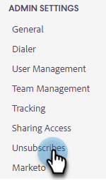

# Einstellung zum automatischen Anhängen von Abmelde-Nachrichten {#auto-append-unsubscribe-message-setting}

Stellen Sie sicher, dass jede gesendete E-Mail eine Abmelde-Nachricht enthält, damit die Empfänger die Möglichkeit haben, sich von der Kommunikation abzumelden. Wenn die Abmelde-Nachricht angehängt ist, enthält die gesamte Kommunikation, die Ihr Team von Marketo Sales sendet, eine Abmelde-Nachricht, einschließlich der von der Webanwendung gesendeten E-Mails, Salesforce, dem Gmail-Plug-in und dem Outlook-Plugin.

## Zu beachten {#things-to-note}

* Bei E-Mails, die von den Plug-ins gesendet werden, wird die Abmeldung nur angehängt, wenn eine Vorlage verwendet wird.

* Wenn Sie die `{{team_unsubscribe}}` dynamisches Feld in einer E-Mail-Vorlage verwenden und die Einstellung zum Anhängen von Abmeldungen aktiviert ist, füllt das dynamische Feld zum Abmelden Ihre Abmelde-Nachricht aus. _anstelle von_ an Ihre Abmelde-Nachricht anhängen.

## Append aktivieren/deaktivieren {#enable-disable-unsubscribe-append}

1. Klicken Sie auf das Zahnradsymbol und wählen Sie **Einstellungen**.

   

1. Klicken Sie unter &quot;Admin Settings&quot;auf **Abmeldungen**.

   

1. Verschieben Sie auf der Registerkarte Messaging unter Unsubscribe-Nachricht anhängen den Regler in den gewünschten Status.

   

>[!TIP]
>
>Wenn Sie die Einstellung zum Abmelden von Nachrichten anhängen deaktivieren, empfehlen wir, Ihren Vorlagen eine Abmelde-Fußzeile hinzuzufügen, um sicherzustellen, dass Ihre Kommunikation über eine Abmeldeoption verfügt. Sie können dazu Ihre eigene benutzerdefinierte Nachricht zu jeder Vorlage hinzufügen oder die `{{team_unsubscribe}}` [dynamisches Feld](/help/marketo/product-docs/marketo-sales-connect/templates/dynamic-fields/dynamic-fields-glossary.md){target="_blank"}.
