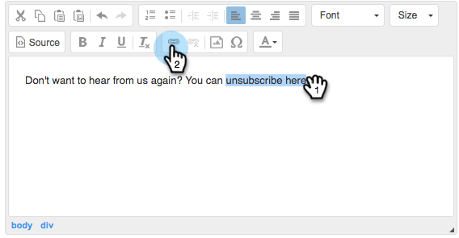

# Anpassen der Nachricht mit dem Abmelde-Link {#customize-unsubscribe-link-message}

Wir haben Teams immer erlaubt, ihre Abmelde-Link-Nachrichten anzupassen, aber Administratoren können jetzt die Abmelde-Link-Nachrichten für ihr gesamtes Team festlegen, um ein konsistentes Messaging zu gewährleisten.

>[!NOTE]
>
>Sie können keinen Abmelde-Link eines Drittanbieters für [!DNL Sales Connect] verwenden, da diese Informationen nicht in unserer Datenbank erfasst werden.

## Anpassen von Nachrichten für sich selbst {#customize-messaging-for-yourself}

1. Melden Sie sich bei der [Web-Anwendung](https://toutapp.com/login) an, klicken Sie oben rechts auf das Zahnradsymbol und wählen Sie **[!UICONTROL Einstellungen]** aus.

   

1. Wählen [!UICONTROL  unter „Mein ]&quot; die Option **[!UICONTROL Abmeldungen]** aus.

   

1. Schreiben Sie Ihre benutzerdefinierte Nachricht in das Textfeld.

   

1. Markieren Sie den Text, auf den die Benutzer klicken sollen, um zur Abmeldeseite zu gelangen, und klicken Sie dann auf das Link-Symbol.

   

   >[!NOTE]
   >
   >Es spielt keine Rolle, welche URL der Hyperlink ist. Wenn die E-Mail gesendet wird, wird dieser Hyperlink in unseren Abmelde-Link konvertiert.

1. Klicken Sie auf **[!UICONTROL OK]**.

   

## Festlegen von Abmelde-Nachrichten für Ihr Team {#set-unsubscribe-messaging-for-your-team}

1. Melden Sie sich bei der [Web-Anwendung](https://toutapp.com/login) an, klicken Sie oben rechts auf das Zahnradsymbol und wählen Sie **[!UICONTROL Einstellungen]** aus.

   

1. Wählen [!UICONTROL  unter &quot;]&quot; die Option **[!UICONTROL Abmeldungen]** aus.

   

1. Passen Sie Ihre Nachrichten an und klicken Sie **[!UICONTROL auf &quot;]**&quot;.

   

1. Wählen Sie **[!UICONTROL Ich stelle die Standardnachricht für mein Team ein]**, damit die Nachricht für alle Benutzer gilt.

   
