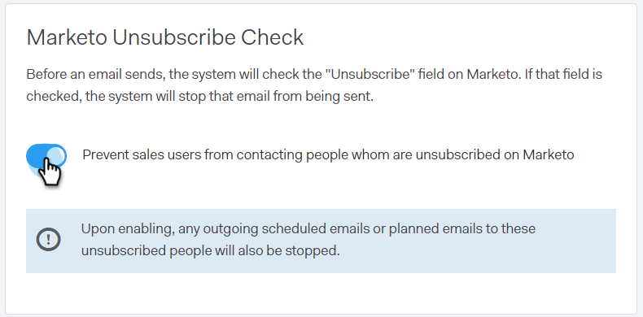

# Überprüfung von Marketo abbestellen {#marketo-unsubscribe-check}

Die Prüfung der Marketo-Abmeldung nutzt die Verbindung Ihres Teams zu Marketo, um zu verhindern, dass E-Mails an Personen gesendet werden, die sich vom Marketo Lead Management System abgemeldet haben. Wenn ein Vertriebsbenutzer eine E-Mail mit Sales Connect sendet, wird ein API-Aufruf an Marketo gesendet, um zu überprüfen, ob die E-Mail-ID abgemeldet wird. Ist dies der Fall, blockieren wir den Versand der E-Mail.

>[!NOTE]
>
>**Erforderliche Administratorberechtigungen**

## Einschalten {#turning-it-on}

1. Klicken Sie in der Webanwendung auf das Zahnradsymbol und wählen Sie **Einstellungen** aus.

   

1. Klicken Sie unter &quot;Admin Settings&quot;auf **Unsubscribes**.

   

1. Klicken Sie auf **Integrationen**.

   

1. Klicken Sie im Bereich Prüfung der Marketo-Abmeldung auf den Regler, um die Prüfung zu aktivieren.

   

## Was zu wissen ist {#things-to-know}

Prüfung der Marketo-Abmeldung ...

* Zählt nicht mit Ihren API-Beschränkungen
* Erfordert die Einrichtung einer Marketo-Verbindung
* Ist eine globale Einstellung
* Blockierungen von E-Mails, die von der Webanwendung, E-Mail-Clients und Salesforce gesendet werden
* protokolliert eine fehlgeschlagene E-Mail oder verhindert, dass ein Benutzer sendet, wenn er versucht, alle Workflows (E-Mail-Plug-in-Versand, individueller Versand, Versand einer Verkaufskampagne, Mehrfachauswahl und Versand) zu senden, mit Ausnahme von [Gruppen-E-Mails](/help/marketo/product-docs/marketo-sales-connect/email/using-the-compose-window/composing-bulk-emails-with-select-and-send.md), in denen wir verhindern, dass die E-Mails still gesendet werden
