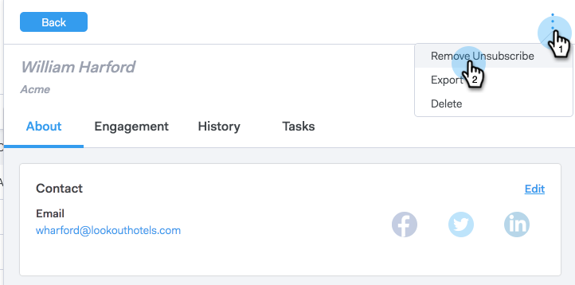

# Abmeldung erneut anmelden {#resubscribing-an-unsubscribe}

Manchmal möchten Benutzer sich wieder für den Erhalt von E-Mails entscheiden. Hier ist, wie man die Abmeldungen wieder versendefähig macht.

>[!NOTE]
>
>**Erforderliche Administratorberechtigungen**

>[!CAUTION]
>
>Bevor Sie eine Person erneut abonnieren, sollten Sie nachweisen können, dass die Genehmigung zur erneuten Anmeldung dokumentiert ist und allen geltenden Gesetzen entspricht.

>[!NOTE]
>
>Wenn Sie die Abmelde-Synchronisation aktiviert haben, müssen Sie die Abmeldung von ToutApp entfernen und die Abmeldung in Salesforce deaktivieren, damit der Personendatensatz nicht erneut synchronisiert wird.

1. Wechseln Sie zur [Webanwendung](https://toutapp.com/login) und klicken Sie auf **Personen**.

1. Wählen Sie die Person aus, um die Personendetailansicht zu öffnen.

   

1. Klicken Sie auf die drei Punkte in der Personendetailansicht und wählen Sie **Abmeldung entfernen** aus.

   

1. Wählen Sie den Grund aus, warum die Person für den Empfang von E-Mails angemeldet ist, und klicken Sie dann auf **Abmeldung entfernen**.

   

>[!NOTE]
>
>Wenn Sie die Synchronisierung zum Abmelden aktiviert haben, müssen Sie auch das Opt-out-Feld im Datensatz in Salesforce deaktivieren. Andernfalls wird die Person in Sales Connect durch die nächtliche Synchronisierung erneut abgemeldet, da die Person in Salesforce abgewählt wird. Wenn einer der Datensätze abgemeldet/abgemeldet wird, markiert die Synchronisierung den verknüpften Datensatz als solchen.
